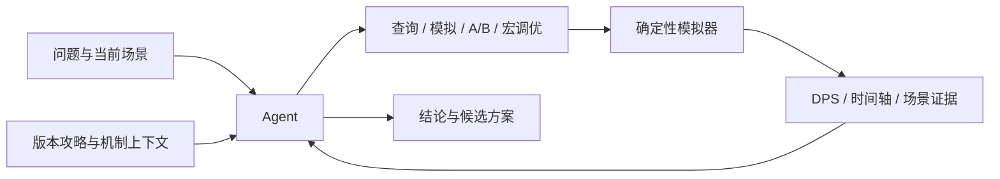

# 苍云器灵 · 战斗模拟与策略分析

面向《剑网3》苍云职业的战斗模拟与分析平台。支持手动循环、宏与配装对比，通过时间轴定位技能衔接、资源分配和增益利用问题，并由 AI 调用模拟器验证候选方案。

## 核心功能

| 功能 | 使用方式 | 分析结果 |
| --- | --- | --- |
| 循环诊断 | 输入技能序列或宏，配置装备、奇穴、秘籍与战斗环境 | DPS、伤害构成、资源变化、Buff 覆盖与技能时间轴 |
| 方案对比 | 在同一场景下替换宏、装备或其他参数 | 输出差异、技能贡献变化与适用条件 |
| 宏蒸馏 | 从手动循环生成分体态宏，经过算法调优与模拟验证 | 最终宏、每页字数与相对原循环的输出保留率 |
| AI 分析 | 用自然语言提问，结合当前循环和版本攻略多轮分析 | 来源引用、已测候选，以及可跳转到时间轴的技能位置 |

## 战斗规则与数值模型

- 支持山海源流、暗影千机两个版本，以及分山劲、铁骨衣两种心法；默认暗影千机 / 分山劲。
- 基础数据按版本组织，技能、奇穴、秘籍和 Buff 的条件机制由独立 Rust 脚本实现。
- 伤害预览、完整模拟、宏优化、配装搜索与强化学习共用九步取整伤害链，区分普通伤害、破招和真实伤害。
- 时间轴记录技能释放、体态切换、怒气消耗与返还；Buff 时间覆盖率与平均层数分别统计。
- 配装搜索支持属性收益分析、Pareto 筛选与候选复算；场景哈希和 fingerprint 用于检查实验口径及结果一致性。

## AI 如何参与分析

模型负责理解问题、查阅资料、选择实验和解释结果；Rust 模拟器负责数值计算。工具选择随问题和已有证据调整，用户目标存在歧义时再追问。



知识检索结合向量与 BM25，并在召回前筛选版本和来源资格。模型可以读取已保存方案、定位具体技能事件、比较配装及迭代宏。结果区分模拟事实、机制判断和待验证假设，候选方案由用户决定是否应用。

前端提供阶段概述、技能悬停预览和时间轴定位；会话可继续，后台保留复现记录，前端返回脱敏内容。

## 案例：将手动循环压缩为双页宏

宏受体态、条件表达和每页字数限制。系统先从释放前状态生成规则，再用释放次数反馈、剪枝、同页调序和条件微调搜索候选。Agent 分析差距、修改候选，并可再次调用优化器与模拟器，最终交付一份选定宏。

一次 300 秒同场景模拟的结果：

| 指标 | 原手动循环 | 最终宏 |
| --- | ---: | ---: |
| DPS | 2,968,513.35 | 2,919,629.54 |
| 相对输出 | 100% | 98.35% |
| 盾 / 刀页字数 | — | 87 / 73 |

该轮使用 Flash，经过 511 次实际模拟，耗时约 205 秒。最终交付文本与已测候选一致。

**这是单场景的模拟输出保留率，不是 DPS 提升率或游戏内实测。** 数值与候选通过核验，但模型解释仍有机制错误，尚不能视为全局最优。[实验记录](docs/baselines/2026-09-06-agent-macro-tuning-repair-v49.md)

## 强化学习实验

独立的 HTTP-RPC 环境提供 82 维观测、18 个动作槽位，支持 PPO、行为克隆和策略回放，与宏执行共用核心模拟逻辑。当前主要研究分山劲离散技能决策，完整训练流程尚未接入 Agent。

## 技术与运行

后端使用 Rust + Axum，原生 HTML / CSS / JavaScript 前端由后端直接托管，无前端构建步骤。多用户模式通过 Router 为每个账号分配独立 worker 进程和数据目录，支持 HTTPS 代理与流式响应。

安装 Rust stable 后，在 Windows 仓库根目录运行：

```powershell
.\start.bat
```

或手动启动：

```powershell
cd backend
cargo run
```

访问 `http://localhost:3005`。先选择版本和心法，配置战斗环境，再输入序列或宏进行模拟。

AI 默认使用离线测试模式。真实模型配置见 [provider 示例](config/agent.providers.example.toml)：通过 `JX3_AGENT_CONFIG` 指定配置，API key 仅由服务端环境变量注入。支持 OpenAI Responses 与 OpenAI-compatible Chat，可选择 Pro / Flash 等 profile。本地知识库通过 `JX3_KNOWLEDGE_ROOT` 指定；知识库全文、模型缓存和用户历史不随仓库分发。

RL 训练依赖见 [python/requirements.txt](python/requirements.txt)。

## 验证与范围

- 2026-09-07：Rust 单元测试 **337 项通过、1 项忽略**。
- 2026-09-06：工具级固定评测 **20/20**，模型级离线评测 **12/12**；固定题集结果不代表开放问答准确率。
- 历史 8 个 golden 回归基准存在数据哈希漂移，尚未全部通过。
- 移动、仇恨及完整团队战斗尚未完整建模；2025.10 归档缺少独立团辅与阵法数据。
- 模型仍可能出现解释错误或超时；候选策略需要结合版本、场景和游戏内表现进一步验证。

基础检查：

```powershell
cargo test --manifest-path backend/Cargo.toml
node --check frontend/app.js
node --check frontend/agent.js
```

## 许可证

原创源码、测试、脚本和文档采用 [MIT License](LICENSE)。游戏名称、数据、图标及第三方内容的权利归原权利方所有，不属于 MIT 授权范围，详见 [第三方声明](THIRD_PARTY_NOTICES.md)。本项目与游戏官方无隶属或背书关系。
