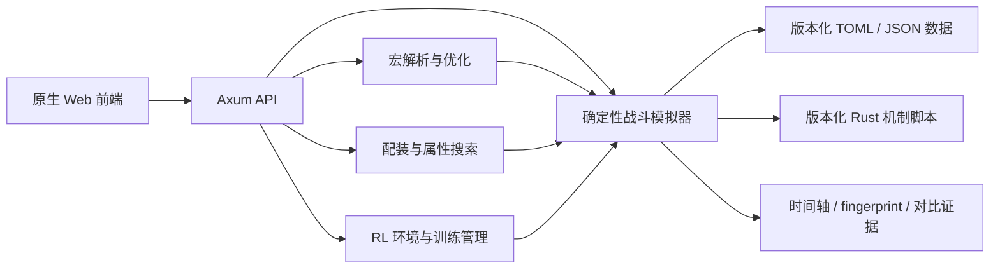

# 苍云器灵 · MMO 战斗策划实验平台

> 将《剑网3》苍云职业的战斗规则抽象为确定性模拟环境，并用搜索、强化学习与可解释分析辅助战斗、系统和数值策划决策。

这是我面向 2027 届游戏策划岗位准备的个人作品集项目。项目重点不是复刻一个游戏界面，而是展示如何把复杂战斗规则转化为可以配置、验证、对比和部署的策划工具。

当前已经实现战斗模拟、宏优化、配装搜索和强化学习环境；战斗分析 Agent 已完成四个只读工具、有界编排、证据校验、Run/SSE、用户隔离持久会话和实验面板，并支持可替换的离线/OpenAI Responses/OpenAI-compatible Chat provider。DeepSeek V4 Pro 已完成真实固定评测和多轮会话验收；公网演示仍关闭，等待单独确认发布安全边界。

## 90 秒了解项目

1. 运行 `start.bat`，浏览器访问 `http://localhost:3005`；
2. 选择游戏版本与苍云心法，配置奇穴、秘籍、属性和团队环境；
3. 用手动循环或宏运行确定性模拟，查看 DPS、技能占比和战斗时间轴；
4. 使用宏生成/剪枝/遗传优化、配装搜索或 RL 页面比较不同策略；
5. 通过 fingerprint、golden 和对比工具验证改动是否造成预期外行为漂移。

作品集主线可以概括为：

```text
策划问题 → 规则建模 → 确定性仿真 → 搜索/学习 → 证据解释 → 回归验证
```

## 核心能力

### 战斗规则与数值建模

- 支持 `2025_10_山海源流`、`2026_04_暗影千机` 两套独立职业数据与机制脚本；
- 支持分山劲与铁骨衣心法、技能、奇穴、秘籍、Buff、团队增益和阵法；
- 使用数据配置承载基础规则，使用版本化 Rust 脚本表达条件机制；
- 共用九阶段伤害链，避免页面、宏、优化器和 RL 各算一套数值；
- 时间轴与 fingerprint 用于解释输出和检测 silent regression。

### 宏与策略优化

- 剑网3风格宏解析和条件求值；
- 宏执行、生成、剪枝和候选规则池；
- 结构化遗传算法与数值参数优化；
- 在表达式、姿态页和宏长度约束内寻找可执行策略，而不只给理论 DPS 上限。

### 配装与系统分析

- 装备、附魔、五彩石与套装效果建模；
- 属性收益、局部替换和 DPS 预览；
- 自动配装、Pareto 筛选与属性拟合；
- 支持将搜索结果送回同一个模拟器复验。

### 强化学习

- 82 维观测、18 个动作槽位的 HTTP-RPC Gym 风格环境；
- 自研 PPO 与行为克隆训练流程；
- 支持训练、checkpoint、rollout 和策略分析；
- 当前重点覆盖分山劲离散技能决策，尚未声称覆盖完整团队战斗或 Boss AI。

### 工程与部署

- Rust + Axum 后端同时提供 API 和静态前端；
- 原生 HTML/CSS/JavaScript 前端；
- Router + per-user worker 的多用户进程隔离；
- 本地、Cloudflare Quick Tunnel、自建 VPS + frp 三种运行路径；
- 真实部署配置、用户数据、模型权重和日志不进入 Git。

## 系统架构



最重要的架构约束是：模拟器是数值事实源。搜索算法、强化学习和未来 Agent 可以提出方案，但最终结果必须由确定性模拟器验证。

## 快速开始

### 环境

- Rust stable toolchain；
- Windows 可直接使用 `start.bat`；
- Python 仅在运行 RL 训练/分析功能时需要，依赖见 `python/requirements.txt`。

### Windows 一键启动

```powershell
.\start.bat
```

默认只监听 `127.0.0.1:3005`。Rust 后端已经托管前端，不需要再启动 8080/8081 的独立静态服务器。

### 手动启动

```powershell
Set-Location backend
cargo run
```

服务启动后访问：

- 页面：`http://localhost:3005`
- 健康检查：`http://localhost:3005/health`

### 本地 smoke

保持服务运行，在另一个终端执行：

```powershell
powershell -NoProfile -ExecutionPolicy Bypass -File .\tools\smoke.ps1
```

smoke 会验证 `/health`、前端 HTML 和一个实际产生技能事件的 5 秒模拟。

## 验证

### Rust 单元测试

```powershell
Set-Location backend
cargo test
```

当前基线为 113 项通过、0 失败；恢复 2025 独立脚本路由后共有 19 条既有编译 warning，计划作为后续工程卫生任务处理。

### 前端语法

```powershell
node --check frontend/app.js
node --check frontend/agent.js
```

### 确定性与 golden

先以 release 模式启动后端，再运行：

```powershell
Set-Location backend
python tests/diff_baseline.py
```

默认会依次切换并检查 2025.10 与 2026.04 两套版本；测试切换不会写入本地用户选择。检查包括：

- 同请求重复运行 fingerprint 一致；
- lite/full 的 fingerprint、DPS 和总伤害一致；
- 每个版本 4 个代表场景的版本、心法、场景/数据哈希、fingerprint 和完整数值与 Golden v2 一致。

除非确认规则行为发生了有意变化，否则不要使用 `--update` 覆盖 golden。

当前两套版本共 8 个场景均通过确定性、Lite/Full 等价和 Golden v2 检查。旧 Golden 无法追溯到精确版本，已保留为历史证据；新基线记录了生成提交与场景/数据哈希。迁移证据见 [`docs/baselines/2026-08-25-versioned-golden-migration.md`](docs/baselines/2026-08-25-versioned-golden-migration.md)。

### Agent 工具级评测

保持后端运行后，在仓库根目录执行：

```powershell
powershell -NoProfile -ExecutionPolicy Bypass -File .\tools\agent-eval.ps1
```

评测包含 4 题事实读取、6 题单变量 A/B、6 题时间线诊断、2 题非法/不可比较输入和 2 题越权请求。当前基线为 20/20；runner 同时验证工具白名单、数值 fingerprint、非法写入为 0、userdata 前后哈希一致，并在结束后恢复运行前的版本与心法。模型尚未接入，因此这里只声称工具和证据链通过，不声称自然语言回答质量。

300 秒 release 场景下，四个工具各采样 30 次的 HTTP P95 均低于 40 ms，证据身份与 fingerprint 全部重复一致；成功/拒绝 trace、响应体积和完整回归见 [`docs/baselines/2026-08-25-agent-tool-layer.md`](docs/baselines/2026-08-25-agent-tool-layer.md)。

## Game × AI 路线

### 已实现

- 强化学习训练环境与 PPO/BC；
- 遗传算法宏优化；
- Pareto 配装搜索；
- 确定性模拟、时间轴和回归证据。

### 已实现案例：战斗分析 Agent

Agent 围绕明确目标自主调用高层工具：

- `get_current_scenario`
- `simulate_scenario`
- `compare_scenarios`
- `analyze_timeline`

它负责拆解问题、提出假设和组织证据，不直接生成“看起来合理”的伤害数字。当前闭环包括 provider adapter、有界工具循环、数值证据校验、Run API/SSE、append-only 持久会话、有界可见上下文恢复和面试用实验面板。当前 `agent-system/v9` 由服务端预取不可变场景，每题只选一个完整实验，并把报告组织为观察、诊断与决策；涉及无界端时服务端只暴露知识检索，不允许形成本项目模拟结论。报告协议可拆除 Markdown/说明文字等供应商外包装，但内部 schema、引用和数值仍严格校验；紧凑输出预算降低了 JSON 被截断的概率。前端把机器单位转换为中文显示，按结论组织指标，技术边界默认折叠。Phase 1 工具评测保持 20/20；Phase 2 离线模型级评测为 12/12。DeepSeek V4 Pro 固定十题从 1/10 提升到 6/10，复跑为 5/10，三轮越权工具调用均为 0；真实结果不包装成稳定准确率。

一键复验完整离线闭环：

```powershell
powershell -NoProfile -ExecutionPolicy Bypass -File .\tools\agent-phase2-verify.ps1
```

Provider 默认只启用不联网的 `offline` profile；可选服务商配置见 [`config/agent.providers.example.toml`](config/agent.providers.example.toml)，已包含 DeepSeek V4 Pro 与 V4 Flash 选项。API key 只从服务端环境变量读取，不进入网页或用户设置。完整离线验收见 [`docs/baselines/2026-08-26-agent-phase2-offline.md`](docs/baselines/2026-08-26-agent-phase2-offline.md)，真实模型结果见 [`docs/baselines/2026-08-26-agent-deepseek-v4-pro.md`](docs/baselines/2026-08-26-agent-deepseek-v4-pro.md)，作品集叙事与演示流程见 [`docs/AGENT_PORTFOLIO_CASE_STUDY.md`](docs/AGENT_PORTFOLIO_CASE_STUDY.md) 和 [`docs/AGENT_90S_DEMO_SCRIPT.md`](docs/AGENT_90S_DEMO_SCRIPT.md)。公网发布仍需单独确认。

### 差异化案例：RL → 宏蒸馏

让 PPO 策略作为教师，Agent 聚类关键决策与失败分歧，提出人类可读的宏规则，再交给现有宏验证器和 GA 复验。目标不是把神经网络伪装成解释，而是量化“理论策略”到“游戏内可执行宏”的性能差距与表达边界。

总体路线见 [`docs/AGENT_PORTFOLIO_PLAN.md`](docs/AGENT_PORTFOLIO_PLAN.md)，第一阶段的工具协议与验收计划见 [`docs/AGENT_PHASE_1_PLAN.md`](docs/AGENT_PHASE_1_PLAN.md)，第二阶段的模型编排、凭据与会话兼容计划见 [`docs/AGENT_PHASE_2_PLAN.md`](docs/AGENT_PHASE_2_PLAN.md)。
四个只读端点的请求、证据响应和错误码见 [`docs/AGENT_TOOL_HTTP_API.md`](docs/AGENT_TOOL_HTTP_API.md)。

## 项目边界

- 这是玩家研究与策划实验项目，不是官方客户端、插件或战斗服务器；
- Boss 受击、仇恨、位移和完整团队战斗尚未全部建模；
- 2025.10 归档未包含独立团辅与阵法表；旧版本核心职业模拟可用，但不会套用 2026 数据冒充完整赛季环境；
- RL 当前主要研究分山劲离散技能决策；
- 模拟准确性依赖版本数据和机制资料，跨版本结论必须重新验证；
- 公网演示在完成 HTTPS、限流和最小权限检查前不会作为正式服务开放。

## 文档索引

- [`docs/PROJECT_BASELINE.md`](docs/PROJECT_BASELINE.md)：项目模块、规模、技术债和已验证基线；
- [`docs/AGENT_PORTFOLIO_PLAN.md`](docs/AGENT_PORTFOLIO_PLAN.md)：四套 Agent 方案和六周路线；
- [`docs/AGENT_PHASE_1_PLAN.md`](docs/AGENT_PHASE_1_PLAN.md)：首批四个只读工具、证据协议与 20 题评测计划；
- [`docs/AGENT_PHASE_2_PLAN.md`](docs/AGENT_PHASE_2_PLAN.md)：模型供应商、工具循环、SSE、证据校验与持久会话计划；
- [`docs/AGENT_RUN_HTTP_API.md`](docs/AGENT_RUN_HTTP_API.md)：Agent Run 创建、状态、SSE、取消与固定错误协议；
- [`docs/AGENT_SESSION_HTTP_API.md`](docs/AGENT_SESSION_HTTP_API.md)：持久会话、append-only 事件、恢复与脱敏边界；
- [`docs/AGENT_PORTFOLIO_CASE_STUDY.md`](docs/AGENT_PORTFOLIO_CASE_STUDY.md)：战斗分析 Agent 的问题—设计—结果—反思案例；
- [`docs/AGENT_90S_DEMO_SCRIPT.md`](docs/AGENT_90S_DEMO_SCRIPT.md)：90 秒面试演示脚本；
- [`docs/baselines/2026-08-26-agent-deepseek-v4-pro.md`](docs/baselines/2026-08-26-agent-deepseek-v4-pro.md)：真实模型兼容、固定评测、成本和多轮会话基线；
- [`backend/tests/agent_eval/README.md`](backend/tests/agent_eval/README.md)：20 题无模型评测结构、运行方式与安全边界；
- [`backend/tests/agent_model_eval/README.md`](backend/tests/agent_model_eval/README.md)：12 题离线模型级评测、长会话和越权测试；
- [`docs/PHASE_0_PLAN.md`](docs/PHASE_0_PLAN.md)：公开仓库卫生计划；
- [`docs/baselines/2026-08-25-phase0.md`](docs/baselines/2026-08-25-phase0.md)：Agent 接入前的回归与性能锚点；
- [`docs/baselines/2026-08-25-versioned-golden-migration.md`](docs/baselines/2026-08-25-versioned-golden-migration.md)：跨版本 Golden v2 迁移证据；
- [`docs/baselines/2026-08-25-clean-clone-audit.md`](docs/baselines/2026-08-25-clean-clone-audit.md)：全新目录构建、smoke 与跨平台哈希复现；
- [`docs/baselines/2026-08-25-agent-tool-layer.md`](docs/baselines/2026-08-25-agent-tool-layer.md)：P1 工具性能、证据确定性、成功/拒绝 trace 与完整回归；
- [`docs/baselines/2026-08-25-agent-provider-layer.md`](docs/baselines/2026-08-25-agent-provider-layer.md)：P2 provider 协议、凭据边界、mock 与隔离 HTTP 验收；
- [`docs/baselines/2026-08-26-agent-phase2-offline.md`](docs/baselines/2026-08-26-agent-phase2-offline.md)：P2 离线闭环、真实 userdata 增量和一键验收基线；
- [`docs/RELEASE_CHECKLIST.md`](docs/RELEASE_CHECKLIST.md)：公开仓库与 Demo 的发布阻断项；
- [`docs/security/SECRET_SCAN_REPORT.md`](docs/security/SECRET_SCAN_REPORT.md)：脱敏与秘密扫描结果；
- [`THIRD_PARTY_NOTICES.md`](THIRD_PARTY_NOTICES.md)：MIT 适用范围、游戏数据与第三方来源边界；
- [`backend/PERF.md`](backend/PERF.md)：模拟器性能记录；
- [`部署与运维手册.md`](部署与运维手册.md)：参数化本地/公网部署流程。

## 作品集与责任说明

本仓库用于展示个人在战斗策划、系统策划、数值分析、Game AI 和工程部署方面的实践。项目中的游戏名称、技能名称与相关知识产权归原权利方所有；本项目与游戏官方及其关联公司无隶属或背书关系。

本项目原创程序源码、测试、脚本与原创文档采用 [MIT License](LICENSE)。游戏名称、客户端导出/派生数据、图标及第三方来源内容不在 MIT 授权范围内，详见 [`THIRD_PARTY_NOTICES.md`](THIRD_PARTY_NOTICES.md)。
