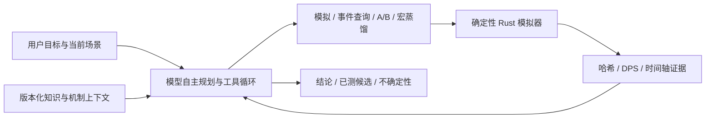

# 苍云器灵 · MMO 战斗策划实验平台

将《剑网3》苍云职业的规则建模为确定性模拟器，用可复现的实验研究输出循环、资源分配、配装收益与宏的表达限制，再由战斗分析 Agent 组织调查、验证候选和解释结果。

这是面向 **2027 届游戏策划岗位** 的个人作品集项目，重点展示战斗机制拆解、数值实验设计和 Game × AI 产品实践。目标用户是希望理解循环损失、比较方案的玩家，以及需要验证规则与策略取舍的战斗、系统和数值策划。

截至 2026-09-07：已实现战斗模拟、宏优化、配装搜索、独立 RL 实验环境与模型自主工具循环；Agent 为 `agent-system/v49`。HTTPS 演示已恢复，仅提供 DeepSeek V4 Flash，入口按需单独提供。

## 先看三个策划问题

| 问题 | 如何验证 | 能交付什么 |
| --- | --- | --- |
| 一套循环为什么损失输出？ | 冻结版本、奇穴、装备与团队环境，检查资源交易、Buff 窗口和具体释放事件 | 时间轴位置、机制依据、实测结果与待验证假设 |
| 改一条规则或一件装备是否更好？ | 保持其他条件一致，运行单变量 A/B 与属性收益分析 | DPS 差异、技能贡献变化、适用条件 |
| 手动循环如何压缩成可执行宏？ | 生成分姿态规则，在字数约束下剪枝、调序、调参，再由 Agent 修订并实测 | 一份选定宏、每页字数、对原轴的输出保留率与损失解释 |

核心方法是：先把设计判断变成可比较的问题，再用同一个模拟器取得证据。模型负责理解目标、选择实验和解释，伤害数值由 Rust 计算。

## 战斗与数值建模

- 版本与心法构成二维边界：`2025_10_山海源流`、`2026_04_暗影千机` × `分山劲`、`铁骨衣`；默认暗影千机 / 分山劲。
- 基础规则使用版本化 TOML / JSON，条件机制使用独立 Rust 技能、奇穴、秘籍与 Buff 脚本。
- 技能伤害预览、完整模拟、搜索与 RL 共用九步取整伤害链；普通伤害、破招与真伤分别遵守字段作用域。
- 模拟记录技能事件、怒气消耗与返还、姿态切换、Buff 覆盖及伤害贡献，支持从汇总追到具体位置。
- 配装研究包括装备、附魔、五彩石、套装效果、属性收益、Pareto 筛选与自动搜索；候选可送回模拟器复验。
- 场景哈希、数据哈希与 fingerprint 绑定实验身份，避免把不同版本或环境的 DPS 直接比较。

## Game × AI：战斗分析 Agent

当前模型自主选择场景读取、版本化知识检索、模拟、时间轴 / 事件定位、保存方案、配装比较及 A/B 工具。服务端提供领域事实、强类型工具、预算和证据校验，任务路径由模型根据问题与已取得证据决定。

- **领域上下文**：从本轮冻结运行表提供技能、已选奇穴、秘籍和机制解释；源码与资料存在分歧时显式记录。
- **知识与证据**：本地知识库采用向量 + BM25 混合检索，召回前过滤版本与资格；跨赛季参考不能证明当前玩法机制。
- **有条件追问**：目标、偏好或用户独有信息会影响方案时收集澄清，回答后继续原任务；可通过工具取得的信息由 Agent 自行查询。
- **可检查交付**：结果包含引用、场景身份与已测候选；前端支持运行进度、继续分析、宏卡片和事件链接。
- **可恢复过程**：会话增量存储，私有 replay 保留复现记录，公开会话 API 返回脱敏投影。



实现与取舍见 [模型主导架构](docs/baselines/2026-09-05-agent-model-led-v38.md)、[机制上下文](docs/baselines/2026-09-05-agent-mechanics-context-v40.md) 和 [追问职责](docs/baselines/2026-09-06-agent-clarification-policy-v41.md)。这些文档是各轮历史记录，测试总数以本文最新基线为准。

## 案例：从手动轴到宏蒸馏 Skill

宏有字数、姿态页与条件表达限制。项目将已有宏生成器和优化器封装为按需加载的业务 Skill，让算法与模型分别承担适合的工作：

1. 冻结完整模拟环境，以手动轴的真实释放前状态生成宏初稿。
2. 复用已有工作流的释放数反馈、剪枝、同页调序和数值条件微调，搜索过程逐次调用模拟器。
3. Agent 根据技能机制、目标计数和缺失技能诊断差距，修改完整候选，并可再次调用算法调优。
4. 用 `compare_scenarios` 实测候选，交付一份选定宏及相对基线结果；中间版本留在实验记录中。

v49 的一次 Flash 验收中，同一冻结场景的原轴为 **2,968,513.35 DPS**，最终宏为 **2,919,629.54 DPS**，保留约 **98.35%**；盾 / 刀页分别为 **87 / 73 字**。该轮经过 10 次工具调用、511 次实际模拟，耗时约 205 秒。

这是单场景结果，不代表平均提升、全局最优或游戏内直接可用。该次交付文本与已测候选一致，但报告仍出现宏条件和技能机制解释错误，因此状态为 `partially_verified`。完整失败原因、算法接入修复和验收证据见 [宏蒸馏 v49 基线](docs/baselines/2026-09-06-agent-macro-tuning-repair-v49.md)。

Skill 正文：[macro-distillation/v2](backend/agent_skills/macro_distillation/SKILL.md)。独立的宏页面也保留生成、剪枝、遗传优化与参数搜索入口。

## 独立研究模块：强化学习

现有 HTTP-RPC Gym 风格环境提供 **82 维观测、18 个动作槽位**，配套自研 PPO、行为克隆、checkpoint、rollout 与策略分析。当前研究范围主要是分山劲离散技能决策。

RL 与 Agent 共用模拟事实源，但目前没有把完整 RL 训练和策略蒸馏流程接入 Agent。上面的宏蒸馏案例以冻结循环为输入；RL 教师策略到宏的进一步研究仍是后续方向。

## 本地启动

需要 Rust stable；Windows 可在仓库根目录运行：

```powershell
.\start.bat
```

或手动启动：

```powershell
Set-Location backend
cargo run
```

默认监听 `127.0.0.1:3005`，访问 `http://localhost:3005`。后端同时托管原生 HTML / CSS / JavaScript 前端，无前端构建步骤，也不需要独立静态服务器。

先选择版本与心法，配置奇穴、秘籍、装备、团队环境和目标，再用手动循环或宏运行模拟。查看 DPS 与时间轴后，可在 Agent 面板提出具体分析目标。

Python 仅在运行 RL 或相关分析脚本时需要，依赖见 [python/requirements.txt](python/requirements.txt)。

### 模型与知识配置

无自定义配置时使用不联网的 `offline` 测试 profile。真实模型支持 OpenAI Responses 与 OpenAI-compatible Chat adapter，示例含 DeepSeek V4 Pro / Flash，业务工具协议与供应商解耦。

将 [provider 配置示例](config/agent.providers.example.toml) 复制到仓库外或被忽略的 `agent.providers.toml`，启用所需 profile，并在启动服务前配置：

| 服务端环境变量 | 用途 |
| --- | --- |
| `JX3_AGENT_CONFIG` | provider 配置文件路径 |
| `JX3_DEEPSEEK_API_KEY` | DeepSeek 凭据；其他 adapter 使用示例指定的变量 |
| `JX3_USERDATA_DIR` | 当前实例的用户数据目录 |
| `JX3_KNOWLEDGE_ROOT` | 本地知识 Vault 路径 |
| `JX3_KNOWLEDGE_RETRIEVAL` | `embedded` 或 `bm25` |

凭据仅由服务端环境注入，不写入配置值、浏览器、用户设置或 Git。知识 Vault、向量模型缓存与用户历史不随仓库分发；新克隆不会自动获得作者的完整知识库。Embedded 检索不可用时显式降级 BM25。

## 验证与已知缺口

2026-09-07 本轮复跑为 **337 项 Rust 测试通过、1 项私有场景重放测试默认忽略**；2026-09-06 v49 基线记录工具级离线评测 **20/20**、模型级离线评测 **12/12**，本轮未重跑这两套完整评测。离线题集验证协议与证据边界，不能等同于开放问题的真实模型准确率。

| 验证项 | 当前结果与范围 |
| --- | --- |
| Rust 与 HTTP | 337 passed / 1 ignored；最新发布完成 HTTP 与真实 HTTPS 冒烟 |
| 工具评测 | 20/20；非法写入 0、userdata 不变、测试运行态恢复 |
| 模型级离线 | 12/12；覆盖工具循环、证据引用、会话与拒绝边界 |
| 两版本模拟回归 | 重复确定性与 Lite / Full 一致性通过 |
| 历史 8 个 golden | 仍受既有 `data_sha256` 漂移阻断，尚未全部通过，未覆盖 golden |
| 真实模型 | 有完成案例，也有超时、重复工具调用和解释错误；持续保留失败记录 |

在仓库根目录运行基础检查：

```powershell
cargo test --manifest-path backend/Cargo.toml
node --check frontend/app.js
node --check frontend/agent.js
```

服务运行后，可运行 HTTP 冒烟与 Agent 工具评测：

```powershell
powershell -NoProfile -ExecutionPolicy Bypass -File .\tools\smoke.ps1
powershell -NoProfile -ExecutionPolicy Bypass -File .\tools\agent-eval.ps1
```

完整离线模型闭环：

```powershell
powershell -NoProfile -ExecutionPolicy Bypass -File .\tools\agent-phase2-verify.ps1
```

两版本 fingerprint / golden 回归需 release 服务运行，具体口径与命令见 [backend/PERF.md](backend/PERF.md) 和 [回归脚本](backend/tests/diff_baseline.py)。不要自动更新 golden 消除失败，应先定位数据或行为变化。运行中的 exe 不应被构建覆盖；服务占用时可先用 `cargo check` 检查代码。

## 部署与适用边界

同一 Rust + Axum 可执行文件支持本地、router 和 worker 模式。当前远程演示使用 HTTPS → 反向代理 → 经身份校验的加密隧道 → 本机 router → 每账号独立 worker。

- 公网仅开放 Flash，不限制每日或累计分析次数；仍保留单次超时、资源预算、并发与请求频率保护。
- worker 上限配置为 100，尚未进行 100 人并发负载验收，不能视为已验证容量。
- 按用户选择保留部分旧账号免密兼容，知道用户名的人可以使用对应账号与存档；当前适用于可信范围的小规模演示，不作为生产级安全承诺。
- 本机承担实际计算，关机、休眠或断网会导致演示不可用；入口、账号与部署秘密单独保管。
- Agent 生成候选默认不覆盖已保存的宏、配装或技能数据；会话只在当前 worker 下增量记录。
- Boss 受击、仇恨、位移和完整团队战斗尚未完整建模。2025.10 归档缺少独立团辅、阵法表，不套用 2026 数据冒充完整赛季环境。
- 模拟实现与攻略资料仍有待核对的机制差异；数值结论需要说明版本和场景，候选策略需要进一步游戏内验证。

部署验证与限制见 [Flash 公网恢复基线](docs/baselines/2026-09-06-public-flash-deployment.md)。公开仓库、发布标签与更广泛演示仍需执行 [发布检查表](docs/RELEASE_CHECKLIST.md)。

## 继续阅读

- [简历项目表述](docs/portfolio/RESUME_PROJECT.md) / [简历证据清单](docs/portfolio/RESUME_EVIDENCE.md)：面向游戏策划投递的项目素材与数字出处。
- [项目基线与模块审计](docs/PROJECT_BASELINE.md)：系统组成、工程债务与历史验证记录。
- [作品集案例](docs/AGENT_PORTFOLIO_CASE_STUDY.md) / [演示脚本](docs/AGENT_90S_DEMO_SCRIPT.md)：问题定义与演示组织，历史状态需结合最新基线阅读。
- [Agent Run API](docs/AGENT_RUN_HTTP_API.md) / [会话 API](docs/AGENT_SESSION_HTTP_API.md)：运行、SSE、取消、恢复与持久化边界。
- [工具评测](backend/tests/agent_eval/README.md) / [模型级离线评测](backend/tests/agent_model_eval/README.md)：固定题集与运行方法。
- [逐轮实验基线](docs/baselines)：性能、真实模型结果、失败案例与部署验证。
- [本轮私有同步检查](docs/security/2026-09-07-private-sync.md) / [历史秘密扫描](docs/security/SECRET_SCAN_REPORT.md)：扫描范围、验证结果与公开发布边界。

## 权利说明

本项目为个人玩家研究与策划作品，与游戏官方及其关联公司无隶属或背书关系。游戏名称、技能名称与相关知识产权归原权利方所有。

原创程序源码、测试、脚本与原创文档采用 [MIT License](LICENSE)。游戏数据、图标及第三方来源内容不属于 MIT 授权范围，详见 [THIRD_PARTY_NOTICES.md](THIRD_PARTY_NOTICES.md)。
