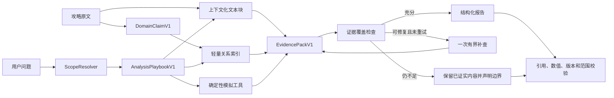

# Agent 领域知识层 V1

状态：V1 已实现并通过离线与真实模型评测；大橙武裂伤仍作为独立战斗实现任务保留。

## 1. 决策

在现有 Embedded 混合检索和确定性模拟工具之间增加一个领域知识层：



V1 不部署 Neo4j、Qdrant 或完整 GraphRAG。关系索引与现有文本索引同进程、只读、可删除重建；原始 Markdown 仍是唯一资料源。

## 2. 设计目标

领域层必须解决以下问题：

1. 同一个名词在旗舰端、无界端、不同赛季或不同心法下含义不同；
2. 正式技改、白皮书、机制测试、宏和副本经验的可信度不同；
3. 相似文本召回不能表达“技能产生资源、资源强化技能、技能延迟伤害”等关系；
4. 攻略中的建议通常带装备、加速、延迟、目标数量或副本时间轴条件；
5. 攻略知识只能提出机制解释和候选，当前数值结论仍要由模拟器验证；
6. 资料内部矛盾或模拟器尚未实现的机制不能静默进入结论。

## 3. `DomainClaimV1`

建议使用下面的逻辑结构；正式实现使用强类型 Rust 结构并拒绝未知字段。

```json
{
  "schema_version": "agent-domain-claim/v1",
  "claim_id": "sha256(canonical claim identity)",
  "subject": { "kind": "skill", "id": "34912", "name": "业火麟光" },
  "relation": "grants",
  "object": { "kind": "buff", "id": "麟光甲", "name": "麟光甲" },
  "statement": "施展业火麟光后获得 9 层麟光甲，后续苍雪刀招式逐层消耗。",
  "claim_type": "game_mechanic",
  "authority": "current_whitepaper",
  "scope": {
    "client": "flagship",
    "game_version": "2026_04_暗影千机",
    "season": "暗影千机（2026）",
    "mount": "分山劲",
    "mode": "pve",
    "encounter": null
  },
  "conditions": [],
  "valid_from": "2026-04-23",
  "valid_to": null,
  "source": {
    "document_id": "knowledge document id",
    "document_hash": "sha256",
    "chunk_hash": "sha256",
    "heading": "1.2.1 常规奇穴 / 业火麟光",
    "source_url": "https://www.yuque.com/sgyxy/cangyun/whitepaper-23",
    "yuque_url": "https://www.yuque.com/sgyxy/cangyun/whitepaper-23",
    "source_updated_at": "2026-08-15T07:03:28+08:00"
  },
  "confidence": "high",
  "conflict_status": "clear",
  "verification": {
    "simulator_support": "implemented",
    "observable_fields": ["buff_coverage", "timeline"],
    "applicable_tools": ["simulate_scenario", "analyze_timeline"],
    "notes": []
  }
}
```

### 3.1 Claim 类型

| 类型 | 用途 | 能否直接描述当前玩法事实 |
| --- | --- | --- |
| `official_change` | 正式服公告中的武学变更 | 可以，但要按生效日期覆盖旧条目 |
| `game_mechanic` | 当前技能、资源、Buff、CD、伤害段机制 | 可以 |
| `measured_mechanic` | 作者通过游戏测试得到的时序或底层机制 | 可以作为高质量机制证据，但要显示测试性质 |
| `derived_formula` | 根据样本反推的公式 | 只能声明为推导，不能伪装成官方公式 |
| `player_practice` | 循环、宏、配装和副本打法经验 | 可以形成条件化建议，不能升级为唯一正确答案 |
| `optimization_hypothesis` | 待 A/B 验证的优化方向 | 只能作为实验候选 |
| `simulator_fact` | 当前代码、场景和工具产生的事实 | 可以支撑本次实验数值 |
| `historical` | 已失效或旧赛季机制 | 仅限历史问题 |

### 3.2 资料权威等级

由高到低不是简单决定“谁一定正确”，而是决定冲突时能否作为默认当前事实：

1. `official_current_patch`：当前正式服、时间更晚的官方变更；
2. `current_whitepaper`：已同步后续技改的当前赛季白皮书；
3. `current_mechanism_test`：当前版本可复现的机制测试；
4. `current_practical`：当前副本、宏和玩家实践；
5. `current_derived`：当前版本推导；
6. `historical_explicit`：用户明确要求的历史资料；
7. `metadata_only`：只能回答来源身份，不能支持玩法事实。

权威等级不覆盖范围边界。旗舰端官方资料不能回答无界端机制，分山劲白皮书不能替代铁骨衣资料。

## 4. 范围模型

运行时范围至少包含以下维度：

```text
client        = flagship | wujie
game_version  = 2026_04_暗影千机 | 2025_10_山海源流 | ...
season        = 暗影千机（2026） | 山海源流（2025） | ...
mount         = 分山劲 | 铁骨衣 | 分山劲·悟 | 铁骨衣·悟
mode          = pve | pvp | general
weapon_class  = water_effect | small_orange | orange | unknown
haste_band    = 206 | 14156 | 30158 | custom | unknown
encounter     = boss/phase/mechanic identity | null
environment   = dummy | raid | unknown
```

默认规则延续现有产品约束：未说明客户端时默认旗舰端；有当前计算器场景时继承版本和心法。明确出现无界或“·悟”时关闭模拟工具。

装备、加速、延迟和副本环境是软条件，不作为全库硬过滤；它们进入 Claim 条件和证据覆盖判断。

## 5. 轻量关系模型

### 5.1 节点类型

- `skill`：盾击、斩刀、绝刀、阵云结晦；
- `buff`：血怒·惊涌、援戈、嗜血、麟光甲、天下宏愿；
- `resource`：怒气、援戈层数、血影触发机会；
- `stance`：擎盾、擎刀、盾墙；
- `cooldown`：斩刀 CD、业火 CD、橙武 CD、陷阵内置 CD；
- `rotation_phase`：盾系填充、斩绝绝、业火爆发、橙武爆发；
- `talent`、`equipment_effect`、`haste_band`；
- `encounter_window`：无敌、易伤、转火、移动、目标消失；
- `observation`：GCD 空档、CD 等待、Buff 覆盖、怒气触顶样本。

### 5.2 关系类型

首版只接受白名单关系：

```text
grants / consumes / refreshes / resets / reduces_cooldown
enables / requires / replaces / enhances / triggers
delays_damage / changes_stance / affected_by_haste
competes_with / aligns_with / drifts_from
recommended_for / risky_under / invalid_during
observable_by / verifiable_by / unsupported_by
supersedes / conflicts_with / derived_from
```

每条边必须回指至少一个 `DomainClaimV1`，图本身不能成为无来源事实。

## 6. 冲突处理

构建阶段按以下顺序处理：

1. 先按客户端、版本、心法和玩法范围分组，跨范围内容不构成冲突；
2. 同一来源中带“失效”的段落自动标为 `historical`；
3. 同一机制存在明确时间顺序时，后生效的正式技改以 `supersedes` 覆盖旧描述；
4. 白皮书和正式公告冲突时，不直接丢弃白皮书，而是保留两条 Claim 并记录覆盖关系；
5. 同一段落的自然语言、公式和例子互相矛盾时标记 `unresolved_internal`；
6. 未解决 Claim 不进入默认事实包，可在用户追问机制争议时展示；
7. 模拟器实现与资料不一致时标记 `implementation_mismatch`，不能把模拟结果描述为完整复现正式服。

## 7. `AnalysisPlaybookV1`

Playbook 是问题类型对应的最小专业分析路径，不包含答案。

```json
{
  "schema_version": "agent-analysis-playbook/v1",
  "playbook_id": "rotation_stall_diagnosis",
  "intents": ["rotation_diagnosis", "idle_time", "空转"],
  "required_scope": ["client", "game_version", "mount"],
  "questions": [
    "是否存在可观测的 GCD 空档或主动 CD 等待？",
    "空档发生在哪两个技能之间？",
    "当时怒气、姿态和关键 Buff 状态是什么？",
    "该时间结构是否违反当前循环框架，还是场景中预期等待？"
  ],
  "knowledge_relations": [
    "generates_resource",
    "consumes_resource",
    "aligns_with",
    "drifts_from",
    "risky_under"
  ],
  "preferred_tools": ["get_current_scenario", "simulate_scenario", "analyze_timeline"],
  "required_observations": ["gcd_gaps", "cd_waits", "rage"],
  "optional_observations": ["buff_coverage"],
  "forbidden_inferences": [
    "怒气触顶样本不能自动等同于已损失怒气",
    "时间相关不能自动证明因果",
    "模拟器时间线不能证明真实网络或按键问题"
  ],
  "retry_policy": "最多一次，仅补足缺失的关系或来源角色",
  "completion_policy": "发布已证实观察，并把未证实原因列为最小实验"
}
```

## 8. `EvidencePackV1`

最终模型不直接接收杂乱检索结果，而接收按 Playbook 整理的证据包：

```text
EvidencePackV1
├─ resolved_scope
├─ selected_playbook
├─ knowledge_claims[]
│  ├─ claim_id
│  ├─ statement
│  ├─ conditions
│  ├─ source evidence id
│  └─ conflict/implementation status
├─ relation_paths[]
├─ simulator_evidence[]
├─ coverage
│  ├─ required dimensions
│  ├─ satisfied dimensions
│  ├─ missing dimensions
│  └─ sufficiency: sufficient | partial | insufficient
└─ answer_constraints[]
```

证据充分度由显式字段决定，不采用“模型感觉够了”的自由判断：

- 版本、客户端、心法、来源资格仍是硬门槛；
- 需要当前数值时，必须有当前 run 的模拟 Evidence；
- 需要因果诊断时，至少要有观测事实和一条机制 Claim；
- 只有攻略经验时，可以给条件化建议，但必须标为资料建议；
- 已有部分证据时，检索失败不能让整轮刹停。

## 9. 与现有实现的兼容方式

V1 不改变现有 `EvidenceEnvelopeV1`。领域 Claim 作为知识检索结果的派生证据，继续由工具层生成 envelope：

```text
search_knowledge_base
  └─ EvidenceEnvelopeV1<KnowledgeSearchResponse>
       └─ results[].chunk_hash
            └─ DomainClaimV1.source.chunk_hash
```

运行时只允许返回当前检索 Evidence 中实际命中的 Claim，防止模型按 `claim_id` 猜测或越权访问全库。

## 10. 已完成的实施顺序

1. 完成暗影千机旗舰分山核心资料阅读和冲突登记；
2. 冻结 `DomainClaimV1`、关系白名单和首批 Playbook；
3. 为现有分块增加短上下文前缀，不改变原文与哈希身份；
4. 构建本地 Claim/关系派生缓存并加入 corpus identity；
5. 新增 `AnalysisPlanV1` 和 `EvidencePackV1`；
6. 将现有 Orchestrator 工具循环改为显式节点和覆盖判断；
7. 用固定题集对领域层版本做 Pro/Flash 分层评测；
8. Prompt 升级到 v13，只负责使用服务端生成的结构化计划和证据包。

## 11. 评测门槛

- 客户端、版本、心法错配进入事实包：0；
- 未解决冲突进入默认事实包：0；
- 攻略数字冒充当前模拟指标：0；
- 当前模拟数值缺少本轮 Evidence：0；
- 已取得部分证据后因检索预算整轮终止：0；
- 代表性专业问题的必需分析维度覆盖率：至少 90%；
- 每条发布的资料结论可回到原文 URL、文档哈希和块哈希：100%；
- 无界问题调用旗舰模拟工具：0。

## 12. V1 实现与验证结果

- `DomainClaimV1`、关系边、`AnalysisPlanV1`、`AnalysisPlaybookV1` 与 `EvidencePackV1` 均已落入 Rust 强类型结构；
- 当前赛季首批 12 条 Claim 绑定原文 URL、文档哈希与分块哈希，并随 corpus identity 一起进入可重建 embedded 缓存；其中 `fs-charge-001` 记录作者于 2026-08-28 修正后的赴敌距离公式；
- 8 类任务使用不同阶段：基线、空转、加速、橙武、宏、副本、机制和来源查找；未说明客户端时默认旗舰端，明确无界时只开放知识检索；
- 工具不是按固定次数机械调用：服务端先做领域检索，模型最多补查一个缺失维度；模拟、时间轴和 A/B 只有在任务与场景具备证据前提时才开放；
- 连续坏 JSON 或空响应不再抹掉已有证据；系统会发布通过校验的部分，或确定性展示可溯源知识摘录；
- Rust 全量测试 181 项通过，Agent 子集 146 项通过；HTTP 工具链与知识来源卡冒烟测试通过；
- 2026-08-28 的 4 类高风险问题、双模型共 8 次零人工重试评测中，Pro 分层综合 100，Flash 91，实际工具越界 0，已计量费用 USD 0.043727。

详细口径见 [`baselines/2026-08-28-agent-domain-playbooks-v13.md`](baselines/2026-08-28-agent-domain-playbooks-v13.md)。
