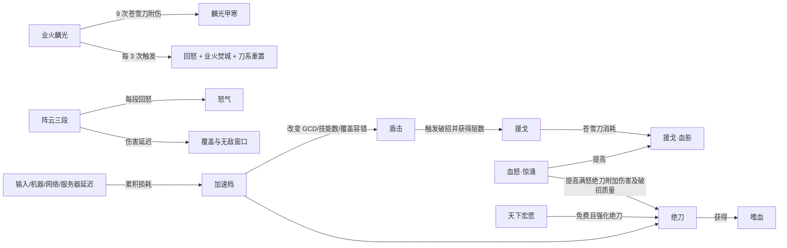

# 暗影千机领域阅读与建模记录

状态：第一轮核心资料完成并已转化为运行时 Claim、Playbook、任务检索锚点和实现边界。

## 1. 本轮范围

默认范围固定为：

- 客户端：旗舰端；
- 版本：`2026_04_暗影千机`；
- 赛季：暗影千机（2026）；
- 心法：分山劲；
- 玩法：PVE；
- 无界端：只允许纯知识搜索，不进入本轮战斗建模和模拟验证。

暗影千机目录共有 21 篇 Markdown。本轮完整或按当前版本章节阅读了以下核心资料：

| 资料 | 角色 | 来源 |
| --- | --- | --- |
| 暗影千机·分山劲白皮书 | 当前技能、奇穴、循环、配装和橙武框架 | [语雀](https://www.yuque.com/sgyxy/cangyun/whitepaper-23) |
| 英雄及挑战阆风悬城·分山实战技巧 | 当前副本时间轴、移动、转火和目标条件 | [语雀](https://www.yuque.com/sgyxy/cangyun/raid-23) |
| 苍云进阶机制（2025） | GCD、体态切换、伤害延迟、距离与底层机制测试 | [语雀](https://www.yuque.com/sgyxy/cangyun/advanced) |
| 低延迟是打高 DPS 的先决条件 | 按键、机器、网络、服务器延迟及实测方法 | [语雀](https://www.yuque.com/sgyxy/cangyun/latency) |
| 苍云技能系数汇总（2021-2026） | 暗影千机正式服技能和破招系数 | [语雀](https://www.yuque.com/sgyxy/cangyun/skillcoefficient) |
| 苍云历次技改汇总（2014-2026） | 4 月正式服、5 月和 7 月后续技改 | [语雀](https://www.yuque.com/sgyxy/cangyun/history) |
| 苍云盾压重置率推导 | 招架等级到盾压重置率的作者推导 | [语雀](https://www.yuque.com/sgyxy/cangyun/guide-260420) |
| 分山绝云宏、分山紫武一键宏、苍云宝宝一键宏 | 玩家自动化手法、延迟适配和循环降级策略 | [JX3BOX](https://www.jx3box.com/macro/106969) |

三个木桩视频条目当前只有公开元数据，没有字幕或可作为事实正文的转录，因此只登记为演示来源，不从标题推导循环细节。

## 2. 当前赛季的领域骨架

### 2.1 循环不是固定字符串，而是约束满足

白皮书的核心不是背诵一条序列，而是在多个约束下分配技能：

1. 斩刀和后续绝刀构成主要刀系输出节；
2. 盾击负责回怒，并通过援戈产生后续血影机会；
3. 阵云三段既是高质量技能和回怒工具，又会与盾击竞争填充位置；
4. 血怒尤其应覆盖满怒绝刀、援戈·血影、业火和高价值阵云；
5. 业火按 9 次苍雪刀触发组织连续爆发，并重置刀系技能；
6. 橙武和业火同为约 50 秒轴，但斩刀约 10 秒轴会与二者产生自然错位；
7. 延迟、目标不可攻击、位移和副本窗口会改变理论序列能否完成；
8. 极限技能数和实战稳定性是两个不同目标。

因此 Agent 应分析“数量、质量、资源转化、时间结构和实战稳健性”，不能只统计绝刀次数或复述 DPS。

### 2.2 关键关系



### 2.3 “高质量技能”的可操作定义

首版不直接计算一个黑盒质量分，而拆成可解释指标：

- 核心技能数量：斩刀、绝刀、阵云三段、橙武绝刀及对应触发段数量；
- 资源质量：绝刀怒气段、援戈是否在血怒期间转化为血影；
- 覆盖质量：血怒、嗜血、麟光、橙武对核心技能的覆盖；
- 时间质量：GCD 空档、主动 CD 等待、业火/橙武/斩刀漂移；
- 稳健性：给定延迟下能否稳定完成，而非理论上可完成；
- 场景适配：目标无敌、消失、转火、移动和易伤窗口是否吞掉延迟伤害或打断序列。

只有工具实际观测到的字段才能写成当前场景事实。

## 3. 首批 Claim 候选

下表是人工评审样例，不是最终机器缓存。

| ID | Claim | 类型 | 条件 | 验证状态 |
| --- | --- | --- | --- | --- |
| `fs-yg-001` | 盾击触发援戈破招并获得援戈层数，苍雪刀消耗层数触发援戈·血影 | `game_mechanic` | 暗影千机旗舰分山、选择援戈 | 模拟器已实现，可观察技能事件和 Buff |
| `fs-yg-002` | 血怒期间援戈·血影伤害提高 50% | `game_mechanic` | 同上且血怒生效 | 模拟器已实现，可用同场景候选验证 |
| `fs-yh-001` | 业火获得 9 层麟光甲，苍雪刀逐层消耗；连续三次触发后回怒、造成业火焚城并重置刀系 | `game_mechanic` | 选择业火麟光 | 主体已实现；需要核对所有重置和触发段可观察性 |
| `fs-zy-001` | 阵云、月照伤害分别延迟约 0.625 秒、0.5 秒生效，回怒随伤害延迟 | `measured_mechanic` | 当前进阶机制资料 | 模拟器对命中延迟/场景无敌的覆盖需要单独核对 |
| `fs-zy-002` | 阵云或月照不适合作为血怒收尾技能，因为伤害延迟可能落在 Buff 结束后 | `player_practice` | 血怒边界窗口 | 需要时间轴能关联触发伤害时刻与 Buff |
| `fs-stance-001` | 盾飞后约 0.375 秒切换至擎刀；盾回时间受目标距离影响 | `measured_mechanic` | 旗舰通用 | 当前模拟器是确定性环境，不能外推真实客户端卡盾飞成功率 |
| `fs-cw-001` | 天下宏愿 4 秒内强化并免除绝刀怒气消耗；14156 下通常完成 3 次绝刀 | `game_mechanic` + `player_practice` | 大橙武、14156、给定延迟 | 主效果已实现；技能数需要按场景模拟 |
| `fs-cw-002` | 2026-07-13 后天下宏愿绝刀给目标叠加裂伤 DOT，最多 3 层 | `official_change` | 7 月 13 日后正式服大橙武 | 当前模拟器未实现，见冲突/缺口 C-003 |
| `fs-haste-001` | 14156 相比 206 每个循环小节可增加一个盾击，从而增加援戈和潜在单走绝刀机会 | `player_practice` | 当前常规分山循环、延迟允许 | 需要 A/B 模拟，不应直接宣布所有配装更优 |
| `fs-haste-002` | 水特效纯一键宏可能更适合 206；手动、小橙武和大橙武更常采用 14156 | `player_practice` | 武器、操作方式和延迟已知 | 条件化推荐，不能硬编码成唯一规则 |
| `fs-haste-003` | 橙武四段阈值可增加盾系填充和橙武绝刀数量，但与 14156 的 DPS 接近，且存在延迟舒适区和属性损失 | `player_practice` | 大橙武、约 30158 阈值 | 必须由用户配装和延迟场景验证 |
| `fs-latency-001` | 技能间隔同时受按键、机器、网络和服务器处理影响，损耗会累积到技能数量和 Buff 覆盖 | `measured_mechanic` | 实战环境 | 模拟器只支持配置化网络延迟，不能还原全部来源 |
| `fs-raid-001` | 阆风悬城老四若业火开启过晚，可能与斩/破阶段冲突 | `player_practice` | 指定 Boss 和团队倒数 | 纯副本知识；当前木桩模拟器不能证明 |
| `fs-raid-002` | 千机源枢的目标体积/距离补偿和阶段窗口会改变陷阵、突进、盾回及爆发交法 | `player_practice` | 指定 Boss/阶段 | 当前模拟器没有 Boss 几何与机制时间轴，不做数值验证 |
| `fs-parry-001` | 盾压重置率可用招架等级放大 3.154 倍后代入同构曲线解释 | `derived_formula` | 130 级、作者给定样本 | 只标为推导；不可冒充官方公式 |

## 4. 首批 Playbook

### 4.1 当前循环输出基线

回答目标：当前场景主要输出结构是什么，哪些判断已经被模拟器证明。

必需步骤：

1. 冻结当前场景；
2. 执行一次基线模拟；
3. 描述主要伤害来源和技能数量；
4. 需要讨论时间或 Buff 时再执行时间轴分析；
5. 不从伤害占比单独推导“循环有问题”；
6. 给出资料与模拟器的边界。

### 4.2 循环空转诊断

回答目标：找到可观测空档的位置，再区分事实、可能原因和补证实验。

检查顺序：

1. `gcd_gaps` 是否存在、发生在哪两个技能之间；
2. `cd_waits` 是否解释了等待；
3. 当时姿态、怒气和关键 Buff 是否可见；
4. 斩刀、业火、橙武是否发生周期漂移；
5. 是否只是有意等待易伤/转火——当前木桩场景无法直接知道；
6. 怒气触顶只能写“观察到触顶样本”，不能写成已损失多少怒气；
7. 若因果仍不清楚，提出只改变一个变量的 A/B。

### 4.3 加速档选择

回答目标：在武器、操作方式、延迟和配装成本条件下比较 206、14156 或更高档位。

必需范围：武器类型、手动/宏、当前属性、延迟、目标环境。

证据路径：

1. 检索对应加速档的循环变化和作者条件；
2. 对同一配装只修改加速来源或延迟，不能同时更换多件装备后直接归因于加速；
3. 比较 DPS、技能数、核心技能覆盖和属性机会成本；
4. 小差距时报告稳健性和实现难度，不宣布绝对最优。

### 4.4 橙武爆发时机

回答目标：分析橙武与业火、斩刀和血怒的对轴/错轴取舍。

必需步骤：

1. 确认场景确实装备大橙武；
2. 检查橙武、业火和斩刀的实际释放间隔；
3. 检查橙武绝刀数量及血怒覆盖；
4. 区分“减少 CD 空转”和“保证总次数不减少”；
5. 当前实现未覆盖裂伤 DOT 时，所有大橙武总伤害结论必须显示实现缺口。

### 4.5 宏与手动循环

回答目标：解释宏为何采用某个判定，以及它牺牲了什么。

边界：

- 宏是玩家实践，不是游戏机制定义；
- 宏判定值与延迟相关，不能复制为所有用户的固定阈值；
- 一键宏不能稳定完成手动单走绝刀等复杂资源分配；
- 只比较当前场景已加载的宏与手动候选；
- 不提供越过游戏规则的自动化建议。

### 4.6 指定副本实战建议

回答目标：结合 Boss 阶段、目标位置和移动机制给条件化建议。

边界：当前模拟器没有 Boss 几何、无敌、目标消失和团队机制时间轴。副本攻略可以提供操作建议，但不能用木桩模拟数值证明这些建议在副本中必然最优。

## 5. 已发现冲突与实现缺口

### C-001：赴敌距离公式内部矛盾

同一正文先写“实际不触发突进距离取两个距离的最大值”，随后公式却写：

```text
实际不触发突进的距离 = MIN（突进保护距离, 4 尺）
```

紧接的 4 尺距离补偿示例又得到 5.5 尺，符合 `MAX` 而不是 `MIN`。当前标记为 `unresolved_internal`，默认答案只能描述两个规则和示例，不能引用 `MIN` 公式作为已确认事实。

### C-002：后续技改覆盖旧描述

2026-07-13 正式技改把步临单层减疗从 30% 调整为 33%。白皮书/进阶机制和当前 `talents.toml` 的摘要仍有 30% 文本。该效果主要是 PVP，但证明了“当前赛季目录”不能等同于“所有段落都是最新值”。领域层应由 `official_change` Claim 覆盖旧 Claim。

### C-003：大橙武裂伤 DOT 尚未进入模拟器

2026-07-13 正式技改为天下宏愿绝刀新增最多 3 层裂伤 DOT；系数汇总记录为技能 ID `34108`、攻击系数 `1.6328125`。当前模拟器的天下宏愿 Buff 只包含绝刀增伤/免怒和盾压效果，未发现裂伤技能、Buff 或触发脚本。

影响：装备大橙武的模拟结果会缺少该正式服伤害段，不能作为完整的大橙武现版本总伤害基线。修复属于战斗数值行为变更，需要单独确认、实现和更新预期 golden，不能在知识层建设时顺手修改。

### C-004：资料机制超出模拟器环境

以下内容目前只能作为知识建议：

- 盾飞/盾回真实弹道和距离返回时间；
- 客户端卡顿导致目标 Buff 显示/添加异常；
- Boss 无敌、目标消失和不可选中；
- Boss 距离补偿、场地几何、推拉和传送；
- 真实按键、机器、网络和服务器延迟分解；
- 阵云预放穿越无敌窗口的实际命中。

Agent 必须把“模拟器未覆盖”与“资料不足”区分开：前者有攻略证据但无实验能力，后者连可靠资料也没有。

### C-005：推导公式不是官方机制

盾压重置率文档基于四组面板样本反解公式，拟合结果很好，但来源类型仍是 `derived_formula`。Agent 可以解释推导和样本，不应说成官方公开公式；若用于当前数值分析，还要核对模拟器采用的实现。

## 6. 当前模拟器可观测性

`analyze_timeline` 已直接暴露：

- 主动/触发事件数量；
- 技能数量和伤害汇总；
- 主动技能 CD 等待；
- 可观测 GCD 空档及前后技能；
- 怒气最小、最大、结束值和触顶样本；
- 可见 Buff 覆盖率与区间；
- 跳过的序列技能。

当前限制已经由工具声明：

- 怒气触顶样本不能测量损失怒气；
- 时间相关不能自动证明因果；
- Buff 覆盖仅包含当前暴露的时间轴轨道。

下一步不应让模型绕开限制，而应补充领域派生观测，例如：

- 哪些核心技能发生在血怒、嗜血、麟光或橙武区间内；
- 绝刀按怒气段和 Buff 组合分组；
- 援戈获得、消耗和血影触发的数量守恒；
- 业火、橙武、斩刀相邻释放间隔和漂移；
- 阵云触发伤害相对施放时刻的延迟。

这些派生值应由 Rust 工具计算，不让语言模型从长时间轴手算。

## 7. 已实现的行为节点

### 7.1 代表性问题干跑

| 问题 | 预期范围 | Playbook | 必需资料 | 必需工具 | 合格边界 |
| --- | --- | --- | --- | --- | --- |
| “分析当前循环输出基线” | 继承旗舰分山场景 | 当前循环输出基线 | 非强制；需要解释时补当前白皮书 | 场景 + 基线模拟 | 不能仅凭一次木桩宣布循环最优 |
| “为什么这里空转？” | 继承旗舰分山场景 | 循环空转诊断 | 盾击/斩刀/业火/橙武关系 | 基线模拟 + 时间轴 | 先定位空档；无观测时不能臆测断流血或怒气浪费 |
| “206 和 14156 怎么选？” | 旗舰分山；补齐武器/操作/延迟 | 加速档选择 | 白皮书加速章节 + 对应宏资料 | 同场景 A/B | 条件不足时给决策树，不给唯一答案 |
| “橙武为什么少伤害？” | 旗舰分山大橙武 | 橙武爆发时机 | 7 月正式技改 + 白皮书橙武章节 | 基线 + 时间轴 | 必须提示当前模拟器缺少裂伤 DOT，不能把结果当完整正式服基线 |
| “帮我优化一键宏” | 旗舰分山、明确宏和延迟 | 宏与手动循环 | 当前宏正文 + 白皮书循环约束 | 宏模拟/候选对比 | 判定阈值是延迟相关经验，不硬编码为所有用户通用 |
| “千机源枢怎么打？” | 旗舰分山、指定副本 | 指定副本实战建议 | 当前实战攻略 | 无强制模拟 | 明确木桩模拟器没有 Boss 几何、挡板、无敌和推拉时间轴 |
| “无界分山循环怎么打？” | 无界分山劲·悟 | 纯知识说明 | 当前无界白皮书 | 禁用模拟工具 | 固定声明计算器未实现无界端 |
| “盾压重置率怎么算？” | 先判断心法与版本 | 机制/公式解释 | 重置率推导 + 当前实现 | 需要当前场景数值时才模拟 | 明确公式来自样本反推，不描述为官方公布公式 |

实现结果：V1 的范围模型、Claim 类型、8 类 Playbook 和 EvidencePack 已覆盖以上问题；评测同时断言 `playbook_id`、必需分析维度、工具边界与 `implementation_mismatch`，不再只看检索 Top K。

建议新增的领域级评测字段：

```json
{
  "expected_playbook": "rotation_stall_diagnosis",
  "required_dimensions": ["gcd_gap", "cd_wait", "rage", "scope"],
  "required_claims_any": ["fs-yg-001", "fs-yh-001"],
  "required_tools": ["simulate_scenario", "analyze_timeline"],
  "forbidden_claims": ["rage_lost_without_measurement"],
  "expected_boundary_codes": []
}
```

这组断言以后与现有 Recall@5、版本边界和报告校验并行，不替换原有评测。

领域层 V1 已按本文的 Claim 类型、关系白名单和首批 Playbook 实施。大橙武裂伤缺失仍保留为独立战斗实现任务：它会改变橙武结果和 golden，不与知识基础设施混在同一变更中。
