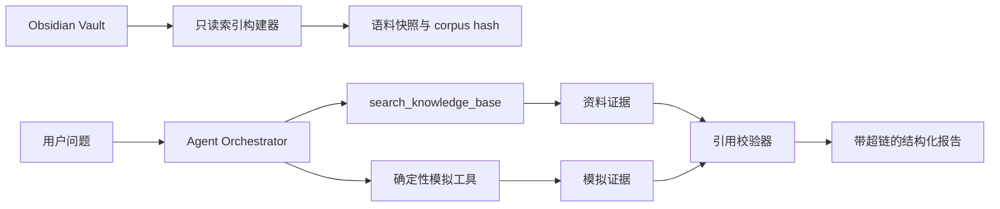

# Agent 本地知识库接入计划

状态：K1–K4 已完成并部署到本地 3005；K5 评测与作品集整理进行中。

## 作品集目标

这个阶段不是给模型追加一段超长背景资料，而是展示一套可部署、可评测、可追溯的 Game × AI 知识增强架构：

1. Agent 能从苍云攻略库检索机制、循环、版本历史和实战经验；
2. 每条资料结论都能回到本地文档、语雀页面或原始站外页面；
3. 攻略资料只负责解释与提出假设，当前战斗数值仍由 Rust 模拟器验证；
4. 检索离线可运行，不依赖语雀、FlowUs 或向量数据库在线可用；
5. 索引、Prompt、语料快照和评测结果都能在面试中复现。

## 已完成的迁移基线

- 语雀目录条目共 161 个：30 篇语雀原生文档、131 个站外条目；
- 站外条目已获得全文 106 篇、仅元数据 23 篇、失败 2 篇；
- 161 篇文档均有语雀知识库信息、目录位置、来源 URL、抓取时间和内容哈希；
- 语雀原生文档另有 slug、UUID、doc_id 与创建/发布时间；
- 外部镜像另有规范 URL、外部标题/作者/时间、HTTP 状态、抽取方法和质量等级；
- 目录按“赛季 → 分类 → 条目”组织，当前赛季“暗影千机（2026）”的展开目录已还原为真实层级；
- 原始导出与规范化 Vault 分开保留，迁移审计缺失文件 0、必需元数据问题 0。

迁移脚本位于 `tools/knowledge/`。运行时通过 `JX3_KNOWLEDGE_ROOT` 指向本地 Vault，不提交个人绝对路径。

## 三种接入方案

### A. 本地确定性检索（推荐先做）

启动时读取 Markdown 和 frontmatter，按标题层级切块，使用中文字符二元组、英文/数字词元和 BM25 风格评分建立内存索引。默认优先当前赛季，允许显式查询历史赛季。

优点：完全离线、零模型费用、结果可重复、部署简单、容易写精确评测；161 篇规模足够。缺点：对非常抽象的同义表达不如向量检索。

### B. 混合检索

在 A 的召回结果上增加 embedding 召回或重排，并保持同一工具协议与引用格式。可选本地 embedding 或管理员配置的远程服务。

优点：语义召回更强，适合后续展示 RAG 迭代。缺点：增加模型、缓存、版本和成本管理；第一版就做会稀释确定性证据链。

### C. 托管向量库

把语料同步到外部向量数据库，运行时远程检索。

优点：适合大规模、多知识库和在线更新。缺点：当前 161 篇规模没有必要，且引入凭据、网络、隐私、配额和公网可靠性问题，不适合作为本阶段起点。

决策建议：先实现 A，并把索引接口设计成可替换后端；完成检索评测后再把 B 作为作品集中的技术演进项。暂不做 C。

## 目标架构



两类证据不能混用：

- 资料证据：解释机制、版本历史、玩家经验和候选思路，必须展示来源超链与赛季；
- 模拟证据：支持当前场景的 DPS、总伤害、时间轴和 A/B 数值结论；
- 知识库里的攻略数字不能直接冒充本次模拟结果；模型若提出数值改动，必须交给强类型候选和 Rust 模拟器验证。

### 版本匹配是硬门槛

问题与资料的版本匹配不依赖模型“自行注意”，由检索层强制执行：

- `AnYingQianJi` 默认只允许“暗影千机（2026）”正文进入当前版本结果；
- `ShanHaiYuanLiu` 默认只允许“山海源流（2025）”正文进入当前版本结果；
- `AnYingQianJiTest` 优先“体服（2021-2025）/130级”，不得混入该目录下 110/120 级旧资料；
- 用户明确指定历史赛季时，只检索该赛季并标记 `historical_explicit`；
- 只有问题明确包含“历史、历次、演变、版本对比、技改对比”等意图时才允许跨版本检索；
- 当前版本没有匹配资料时返回“当前版本资料不足”，不使用旧版本答案静默补位；
- 标题年份、目录赛季、场景版本和文档更新时间同时进入结果，发生冲突时降低质量或拒绝作为当前结论；
- 所有结果必须返回 `version_match`，前端与报告不能隐藏这一字段。

## K1：语料加载与索引快照

新增只读知识模块，启动或首次使用时从 `JX3_KNOWLEDGE_ROOT` 加载 `_migration-manifest.json` 和规范化 Markdown。

索引规则：

- 排除 `_source`、README、迁移报告和 `mirror_status: failed`；
- `metadata_only` 只进入来源发现索引，不进入事实正文索引；
- 按 Markdown 标题分块，限制单块字符数并保留少量重叠；
- 保存标题、赛季、分类、来源站点、语雀 URL、外部 URL、更新时间、质量等级、文档哈希和块哈希；
- 默认提升当前游戏版本对应赛季的权重，历史赛季结果必须带“历史资料”标记；
- 对整个清单与有效块生成 `corpus_hash`，随每次检索证据保存。

若目录未配置、清单损坏或哈希不一致，Agent 主功能仍可运行，知识工具明确返回不可用，不影响原模拟器。

## K2：有界知识检索工具

新增第五个只读工具 `search_knowledge_base`，不开放任意文件路径、URL 或网络访问。

建议输入：

```json
{
  "query": "盾飞期间劫刀数量和断流血风险",
  "season": "current",
  "category": null,
  "top_k": 5
}
```

边界：

- query 最长 200 字符；
- top_k 为 1–5；
- 赛季与分类只能从索引中的白名单选择；
- 每次 run 最多检索 2 次；
- 每条结果返回有界摘录，不返回整篇文档；
- 文档正文视为不可信数据，不能覆盖系统提示词；
- 工具只读，不触发实时爬虫，不接受任意路径和 URL。

结果包含 `corpus_hash / query / filters / results[]`。每个 result 至少包含标题、赛季、分类、摘录、质量等级、source URL、Yuque URL、document hash、chunk hash 和评分。

## K3：资料引用与报告校验

Prompt 已升级至 v5。报告由服务端从本轮被引用的检索证据派生结构化 `sources`，模型既不提交也不能自行拼接链接：

```json
{
  "evidence_ids": ["..."],
  "document_id": "...",
  "title": "...",
  "source_url": "https://...",
  "yuque_url": "https://...",
  "season": "暗影千机（2026）",
  "version_match": "current_exact",
  "fact_eligible": true,
  "document_hash": "..."
}
```

来源字段只从已校验 Evidence Envelope 复制，并限制为 HTTP(S) URL；未被本轮报告引用的检索结果不会进入 `sources`。模型伪造 URL、引用本次 run 之外的资料或把失败页面当正文均无法进入结构化来源区。

数值证据白名单已收紧：`metrics` 只能引用模拟、对比或时间轴工具的数值字段；检索评分、文档中的攻略数字和模型计算结果即使路径存在也会被服务端拒绝。

## K4：Agent 策略与前端呈现

Prompt v5 与 Orchestrator 已按问题选择最小闭环：

- 机制/历史/攻略解释：一次知识检索，可不运行模拟；
- 当前循环诊断：知识检索提出假设，再选择一次时间轴或基线实验；
- 候选方案比较：知识检索形成强类型候选，再执行一次 A/B 对比；
- 纯数值基线：保持现有模拟路径，不强制检索。

完整分析页和循环模拟悬浮助手已把“资料来源”和“模拟证据”分区展示：

- 资料来源卡显示标题、赛季、站点、质量等级和可点击原文/语雀链接；
- 历史赛季显示明显标签；
- 仅元数据来源不显示为玩法证据；
- 模拟证据继续显示当前的指标卡与可复现实验身份；
- 会话事件只保存紧凑引用和语料快照身份，不复制整篇资料。

## K5：评测与部署验收

新增固定检索集和端到端问题，至少覆盖：

- 当前赛季机制、循环、配装、宏和实战；
- 历史赛季精确检索与版本冲突；
- 中文同义表达、技能名、数字/ID 混合查询；
- `metadata_only`、失效链接、重复外链和无答案问题；
- 文档内提示注入与伪造链接；
- 知识建议 → 强类型候选 → 模拟验证的双证据闭环。

建议门槛：

- 固定检索集 Recall@5 ≥ 90%；
- 结构化来源链接校验率 100%；
- 失败/仅元数据页面进入事实证据 0 次；
- 历史资料误报为当前版本 0 次；
- 未经模拟验证的当前数值进入 `metrics` 0 次；
- 关闭网络后端到端演示仍可完成；
- 现有 Rust、Agent 工具、会话与前端回归测试不下降。

## 实施顺序与确认点

1. K1：索引器、语料快照和离线检索单测；
2. K2：有界知识工具与证据 envelope；
3. **确认点：展示 10 个真实查询及来源结果，再决定是否进入模型编排；**
4. K3：Prompt v5、结构化 sources 和双证据校验；
5. K4：前端资料来源卡与会话持久化；
6. K5：离线评测、真实模型小额评测、部署说明和作品集案例更新；
7. 任何公网开放仍沿用原 Phase 2 阻断节点 C，默认关闭。

## 本阶段明确不做

- 不让模型直接遍历文件系统或实时抓网页；
- 不把 Vault 或个人绝对路径提交进仓库；
- 不把 embedding/provider 密钥放到浏览器或本地会话；
- 不用知识库替代 Rust 模拟器计算当前战斗数字；
- 不自动删除原始导出、历史赛季、失败记录或已有会话。
