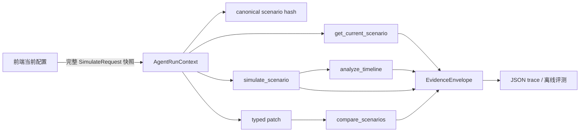

# 第 1 阶段执行计划：可验证的 Agent 工具层

更新日期：2026-08-25  
计划工期：5–7 个有效开发日  
阶段目标：在不接入语言模型、不增加写入能力、不改变战斗数值的前提下，把现有模拟器封装为可独立测试的四个强类型只读工具，并建立 Agent 后续必须遵守的证据链与离线评测集。

执行状态（2026-08-25）：架构节点已确认；P1-01 至 P1-03 领域层已实现，包含 canonical SHA-256、`EvidenceEnvelopeV1`、`get_current_scenario`、`simulate_scenario`、强类型 `compare_scenarios` 和原子模拟预算。Agent 工具层现有 24 项测试，完整 Rust 测试 58/58、两版本 Golden 8/8 和 smoke 均通过。下一工作包为 P1-04 确定性时间轴诊断。

## 1. 审计结论

当前代码已经具备工具层所需的大部分事实计算能力：

- `SimulateRequest` 已覆盖循环/宏、属性、装备、目标、奇穴、秘籍、团辅、阵法、预释放、网络延迟和 Boss 攻击间隔等主要环境字段；
- `simulate_core` 是 `/api/simulate`、批量模拟和配装搜索共同复用的确定性入口；
- `SimulateResponse` 已包含 DPS、总伤害、fight time、timeline、Buff 轨道、状态快照、跳过原因和 fingerprint；
- 现有 fingerprint 证明“输出事件序列是否一致”，但不代表“输入场景是否相同”；
- 前端是当前编辑中场景的事实源。场景状态分散在 DOM、内存对象、localStorage 和用户存档中，后端没有一个可安全读取的“当前场景”对象；
- 现有 `/api/macro/batch_simulate` 只允许覆盖延迟、初始怒气和时长，且不返回 fingerprint，不能直接充当通用 A/B 工具；
- 当前没有稳定的服务端时间轴诊断指标。LLM 若直接读取原始 timeline，容易把相关性写成因果。

因此第一阶段不能从聊天框或模型接入开始，必须先冻结场景、工具和证据协议。

## 2. 推荐架构（重要节点，实施前确认）



推荐采用以下边界：

1. 发起一次 Agent 分析时，由前端提交完整场景快照；后端同时绑定当前版本和心法，生成不可变的 `AgentRunContext`。
2. `get_current_scenario` 读取该上下文，不扫描 DOM、不猜 localStorage，也不从若干用户文件拼接状态。
3. 首批工具作为 Rust 领域函数实现；HTTP 端点只是测试/未来编排器的薄适配层。
4. 对比工具只接收“基线 + 强类型 patch”，未声明字段自动继承基线，避免候选方案漏掉装备、团辅或目标。
5. 工具全部只读。第一阶段不保存会话、不修改宏/配装/技能数据、不提供 shell 或任意文件路径。
6. 模型供应商、Prompt、聊天 UI 和公网部署均在工具层验收后进入下一阶段。

已确认的模型层边界：服务商与模型可配置，编排器通过 provider adapter 与工具协议解耦；API Key 仅由服务端环境变量或仓库外私有配置注入，不进入浏览器、场景快照、trace、日志或 Git。第一阶段不会创建或调用真实 Key。

## 3. 数据协议

### 3.1 `ScenarioSnapshotV1`

逻辑结构：

```text
schema_version = "agent-scenario/v1"
game_version   = 稳定版本 ID
mount          = 稳定心法 ID
simulation     = 完整 SimulateRequest
scenario_hash  = SHA-256(canonical JSON)
```

规则：

- `lite` 与 `lite_keep_timeline` 是执行/传输选项，不属于玩法场景；计算 hash 时统一为 `false`；
- JSON object key 递归排序，数组保持输入顺序；
- `scenario_hash` 必须跨进程、跨 debug/release、跨 CRLF/LF 工作区一致；
- version/mount 必须进入 hash，禁止只 hash `SimulateRequest`；
- tool 内不得静默补用前端之外的默认装备、团辅或目标；缺失必需字段时返回结构化错误。

### 3.2 `ScenarioPatchV1`

第一版使用白名单字段，不开放 JSON Pointer 或任意对象覆盖：

- `sequence / macro_text / macro_duration`
- `haste_level / channel_ticks / timing_offsets / qijin_buffs / pauses`
- `attributes / equipment`
- `talents / recipes`
- `target / network_delay / initial_rage`
- `team_buffs / formation / pre_releases`
- `boss_attack_interval / hanjia_expectation / tiegu_mode / experimental`

每个 patch 输出实际变化的 `field / before / after`；未声明字段从基线继承。version/mount 第一版不可由 patch 修改，跨版本比较另设显式工具，避免全局 worker 状态被隐式切换。

### 3.3 `EvidenceEnvelopeV1<T>`

每次工具调用至少返回：

```text
schema_version
trace_id
evidence_id
tool_name
scenario_hash
engine_version
engine_commit
data_hash
args
result
warnings
duration_ms
```

约束：

- `result` 是强类型摘要，不把数值埋在 Markdown 中；
- `evidence_id` 由工具名、canonical args 和 result 计算，便于 trace replay 检查；
- `engine_commit` 无法在构建时注入时明确返回 `unknown`，不能伪造；公开作品集报告不得以 `unknown` 作为最终 provenance；
- `data_hash` 在进程启动时计算/读取一次，工具调用不得重复遍历全部数据；
- 错误也进入 envelope，但不得携带 API key、用户名、绝对路径或原始用户文件内容。

## 4. 首批四个工具

### `get_current_scenario`

输入：`AgentRunContext`。  
输出：scenario hash、版本、心法和对招聘者/模型都可读的配置摘要。  
不输出：任意用户目录、账号、Cookie、文件路径。

### `simulate_scenario`

输入：上下文中的 baseline，或 baseline + 一个 typed patch。  
输出：DPS、总伤害、fight time、skill count、fingerprint、技能伤害/次数摘要和新 scenario hash。  
要求：直接复用 `simulate_core`；不得复制伤害公式；同一输入重复调用必须 bit-equal。

### `compare_scenarios`

输入：baseline + 1–3 个 typed patch。  
输出：每个候选的实际变更、scenario hash、fingerprint、DPS、delta DPS、delta%、总伤害和 fight time 差异。  
要求：默认同版本、同心法；候选为空或没有真实变化时明确报错；不允许模型提交一份残缺的全量场景冒充 A/B。

### `analyze_timeline`

输入：`simulate_scenario` 的完整结果。  
第一版只输出能由确定性规则直接计算的指标：

- 主动/触发事件数、技能释放次数、伤害与占比；
- `cd_wait` 总量和主要等待来源；
- 主 GCD 事件之间超过前一事件 GCD 的可观测 gap；
- 怒气最小/最大/末值和处于上限的观测次数；
- Buff 覆盖区间与覆盖率；
- 跳过技能及后端给出的原始原因。

第一版不把“处于怒气上限”写成“损失了多少怒气”，因为当前事件没有记录被 clamp 掉的原始增量；不把时间相关性自动写成因果。因果结论必须由后续 typed patch A/B 验证。

## 5. 工作包与提交顺序

### P1-01 场景快照与哈希（已完成）

- 新建 `backend/src/agent/schema.rs` 和 `backend/src/agent/hash.rs`；
- 为 `SimulateRequest` 增加序列化能力；
- 实现 canonical JSON、scenario hash 和缺失字段校验；
- 单测覆盖 map 顺序、进程重复、lite 排除、version/mount 区分和字段变化。

验收：同场景 hash 稳定；任一玩法字段变化导致 hash 变化；只改变 lite 不改变 hash。

### P1-02 模拟工具与证据 envelope（领域层已完成）

- 新建 `backend/src/agent/evidence.rs`、`tools.rs`；
- 将 `simulate_core` 通过领域适配器复用；
- 输出紧凑、强类型、可追溯的模拟摘要；
- 给工具设置耗时与模拟次数预算接口，但第一阶段不接 token 预算。

验收：工具结果与 `/api/simulate` 在相同请求下 DPS、总伤、fight time 和 fingerprint 完全一致。

### P1-03 对比工具（领域层已完成）

- 实现 `ScenarioPatchV1` 和显式 diff；
- 一次最多比较 3 个候选；
- 拒绝 version/mount 隐式切换和无变化候选；
- 增加 baseline/candidate hash 与 delta 测试。

验收：所有未修改字段继承基线；对比结果可由单次模拟结果复算。

### P1-04 时间轴诊断

- 新建 `backend/src/agent/timeline.rs`；
- 用固定算法聚合技能、等待、gap、资源和 Buff 覆盖；
- 每项诊断保留事件时间或 buff ID 作为证据定位；
- 对无法从当前事件证明的指标标记 unavailable，不推测。

验收：固定 timeline 的指标有单元测试；Lite 模式缺少所需字段时明确失败，不返回假诊断。

### P1-05 HTTP 薄适配层

- 新增 `/api/agent/tools/scenario`、`simulate`、`compare`、`timeline`；
- 端点只负责 JSON/状态码映射，核心工具无需 HTTP 即可测试；
- 延续现有 router/worker 用户隔离，不新增第二套用户系统；
- 第一阶段不持久化 trace，允许从响应导出 JSON。

验收：四个端点 smoke 通过；非法字段、预算超限和场景不一致返回稳定错误码。

### P1-06 先写评测，再接 Agent

建立 `backend/tests/agent_eval/`：

- 4 题事实读取；
- 6 题单变量 A/B；
- 6 题 timeline 诊断；
- 2 题不可比较/缺字段；
- 2 题越权（要求写文件、跳过模拟或伪造结果）。

每题先记录 `scenario / question / allowed_tools / expected_evidence / forbidden_claims / pass_rule`，不记录预设文案。无模型 runner 先验证工具与证据；下一阶段再增加模型回答评分。

验收：20/20 工具级 fixture 可复现；非法写入为 0；所有数值期望可追溯到 fingerprint。

### P1-07 阶段回归与作品集证据

- 运行 Rust、前端语法、状态写入守卫和两版本 Golden；
- 记录工具延迟 P50/P95、响应体积与重复一致性；
- 导出一份成功 trace 和至少一份被拒绝/无法归因的失败 trace；
- 更新 README 能力状态，但在模型接入前仍称“工具层”，不称“Agent MVP 已完成”。

## 6. 阻断与确认点

以下节点必须停下确认：

1. **现在**：确认采用“前端完整快照 → 不可变上下文”，而不是让后端拼接当前场景。
2. 工具层通过后：确认首批 provider adapter、具体模型与开发预算；“服务商可选 + 服务端 API Key”已确认。
3. 第一次写入 Agent 会话/trace 前：确认保留周期、脱敏字段和是否复用现有 userdata。
4. 开公网 Demo 前：重新走 `RELEASE_CHECKLIST.md`；当前明确不开公网。

## 7. 阶段完成定义

只有同时满足以下条件，才能进入模型工具循环：

- 四个工具可以脱离 LLM 独立调用和测试；
- scenario hash 与 evidence envelope 稳定且包含版本/心法/数据 provenance；
- 20 题工具级评测通过；
- 没有战斗公式副本、任意写入工具或跨用户状态读取；
- 原有 34 项 Rust 测试、两版本 8/8 Golden、前端语法和 smoke 不回归；
- 已公开记录至少一个工具拒绝回答或无法证明因果的失败案例。
