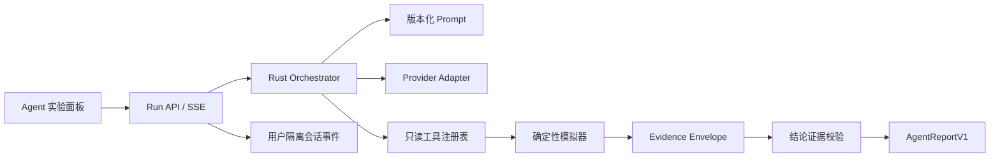

# Agent Phase 2：模型编排与持久会话计划

状态：P2-00 设计冻结候选稿，尚未接入真实模型，尚未创建 Agent 会话数据。

## 阶段目标

在 Phase 1 四个只读、强类型工具之上实现第一个“战斗分析 Agent”闭环：用户提出策划问题，模型拆解问题并调用模拟器，系统把数值结论绑定到可复现证据，最后输出结构化分析报告。

这一阶段要展示的不是聊天界面，而是四项 Game × AI 能力：

1. 把开放式策划问题转成有限、可验证的实验；
2. 让语言模型负责规划和解释，让确定性模拟器负责数值事实；
3. 对模型调用、工具调用、会话数据和成本建立工程边界；
4. 在多用户部署中隔离数据，并能保存、恢复和审计分析会话。

Phase 1 的工具性能、确定性和拒绝行为是本阶段不可弱化的基线，见 [`baselines/2026-08-25-agent-tool-layer.md`](baselines/2026-08-25-agent-tool-layer.md)。

## P2-00 现状审计

### 三类已有状态

项目当前没有 Agent prompt、模型 provider、聊天记录或 Agent 会话表。已有状态分成三类：

| 状态 | 当前载体 | 生命周期 | Phase 2 处理 |
| --- | --- | --- | --- |
| 页面偏好与输入 | 浏览器 `localStorage`，并通过 `/api/settings` 同步到 `settings.json` | 持久 | 不存密钥；仅允许保存无敏感信息的 provider/profile 选择 |
| 模拟、宏、配装等用户数据 | Router 为每个用户设置独立 `JX3_USERDATA_DIR` | 持久、用户隔离 | 原样保留，不迁移、不改名、不覆盖 |
| RL session | Rust 进程内存 | 进程结束即失效 | 不复用为 Agent 会话存储 |

前端当前会把大部分 `localStorage` 同步到服务端，且启动时重新注入浏览器。这意味着 API key 不能进入输入框、本地存储、页面状态或 `/api/settings`。Phase 2 还应在前后端设置同步处增加敏感字段 denylist，作为纵深防御；但凭据的主边界仍是“从不发送到浏览器”。

### Worker 与流式基础设施

- Router 为每个认证用户派生独立目录并启动独立 worker，适合承载用户级 Agent 会话；
- Router 会继承服务端环境变量，因此 provider key 可由 worker 在服务端读取；
- 现有优化器和 RL 已有 SSE、任务状态与取消模式，可以复用其工程经验；
- Router 已支持流式代理，不需要为了 Agent 改变现有登录、cookie 或代理结构；
- 路由日志记录用户和 API 路径，不记录请求体。Agent 层仍需主动禁止记录 Authorization、provider 原始请求/响应和会话正文。

### 数据兼容基线

P2-00 开始时，`backend/userdata` 共计 178 个文件、约 843 KiB；其中包含现有用户的设置、恢复状态、宏、图标缓存和 worker 日志。该目录被 Git 忽略，也不应出现在公开作品集材料中。

Phase 2 的硬约束：

- 不删除、移动或批量重写任何现有用户目录；
- 不迁移 `settings.json`、`resume.json`、`mount_state.json`、宏、配装或白名单；
- 新能力只能在当前 worker 已隔离的用户目录内增加新路径；
- 第一次真实会话写入前再次记录整棵 userdata 的文件清单哈希，并经过人工确认；
- 测试默认使用临时 `JX3_USERDATA_DIR`，不能污染真实用户数据。

## 目标架构



模型不能访问任意 REST、文件、数据库或 shell。Orchestrator 只注册 Phase 1 的四个领域工具：

- `get_current_scenario`
- `simulate_scenario`
- `compare_scenarios`
- `analyze_timeline`

前端提交完整、不可变的 scenario snapshot；同一 run 中的工具调用都绑定该场景身份或显式候选修改，防止模型在分析中悄悄改变版本、心法或环境。

## Provider 与凭据设计

### Profile，而不是任意 URL

服务端读取一组管理员定义的 provider profile。每个 profile 仅包含：

```text
id / label / adapter / model / base_url / api_key_env
```

仓库只提交无秘密的示例配置。实际配置文件由 `JX3_AGENT_CONFIG` 指向本机路径，`api_key_env` 只声明要读取的环境变量名；key 的值只在服务端进程内解析。

`GET /api/agent/providers` 只向页面返回 `id / label / model / available`，不返回 key、环境变量名、完整 base URL 或本地配置路径。用户只能选择管理员预先允许的 profile，不能从请求中传入任意上游地址。

### 首批 adapter

1. `fake`：确定性的离线 provider，用于工具循环、SSE、持久化和评测；
2. `openai_responses`：原生 Responses API adapter；
3. `openai_compatible_chat`：面向提供 Chat Completions 兼容协议的可选服务商。

首版不同时实现更多原生协议。新增 provider 必须只影响 adapter，不得改变领域工具 schema、证据协议或报告格式。

OpenAI adapter 使用自定义 function tools、`store: false` 和强类型参数；第一版关闭并行工具调用。官方 Responses API 支持自定义 function tools、`tool_choice`、`parallel_tool_calls` 和 `store` 控制，因此可以保持上游无持久化、由本项目管理规范化会话状态。参考 [OpenAI Responses API](https://developers.openai.com/api/reference/cli/resources/responses/methods/create)。

上游返回的隐藏推理、原始 provider payload 和临时加密推理项最多只存在于当前 run 内存中，不写入本地会话。后续轮次从可见消息、工具摘要和结构化报告重建上下文。

## Prompt、工具循环与报告

### Prompt 可审计

系统提示词放在：

```text
backend/prompts/agent_system_v1.md
```

它作为版本化源码参与构建或启动校验。每次 run 保存 `prompt_version` 与 `prompt_sha256`，使录屏、评测和面试案例能追溯到准确提示词；不会把提示词藏在网页或环境变量里。

系统提示词至少约束：

- 不自行计算或编造伤害数字；
- 先读场景，再提出可检验假设；
- 变更必须是显式、强类型候选；
- 所有数值结论必须引用 evidence id；
- 工具证据不足时说明限制或拒绝结论；
- 不接受要求跳过模拟、扩大权限或无限搜索的指令。

### 有界循环

单次 run 的初始硬预算：

| 项目 | 上限 |
| --- | ---: |
| 模型轮次 | 6 |
| 总工具调用 | 8 |
| 其中模拟/对比调用 | 8 |
| 候选方案 | 3 |
| 墙钟时间 | 60 秒 |
| 同一用户并行 Agent run | 1 |

预算由 Orchestrator 全局计数，不能依赖模型自律；取消、超时、provider 错误和预算耗尽都生成明确终止状态。真实模型接入前另行确认模型、profile 和开发费用上限。

### 结构化结论

最终输出使用版本化 `AgentReportV1`，至少包含：

- 用户问题与场景身份；
- 已验证 findings；
- 候选修改与 A/B 结果；
- 每个数值 claim 引用的 evidence id；
- 未验证假设与局限；
- 工具/模型用量、耗时和终止原因。

服务端 claim validator 检查数值 claim 是否能在本次 run 的 evidence envelope 中找到来源。校验失败时要求一次结构化修复；仍失败则降级为“证据不足”的报告，而不是把未经验证的答案展示成结论。

## API 与任务生命周期

计划中的最小接口：

```text
GET  /api/agent/providers
POST /api/agent/runs
GET  /api/agent/runs/:run_id/stream
POST /api/agent/runs/:run_id/cancel
GET  /api/agent/sessions
GET  /api/agent/sessions/:session_id
```

`POST /runs` 接收完整 scenario、用户问题、provider profile id 和可选 session id，立即返回 run/session id。SSE 只发送规范化事件，例如 `planning / tool_started / tool_finished / validating / completed / failed / cancelled`，不透传 provider 的隐藏推理。

进程退出后的未完成 run 在恢复时标为 `interrupted`，不自动重发外部请求。重试创建新的 run id，并保留与原 run 的关联。

## 会话保存与旧数据兼容

### 增量目录

每个 worker 在自己的既有 `JX3_USERDATA_DIR` 下新增：

```text
agent_sessions/
  v1/
    <session_id>/
      meta.json
      events/
        000001.json
        000002.json
```

第一版不依赖一个容易损坏的全局索引；会话列表由目录和 `meta.json` 构建。事件文件先写同目录临时文件，再原子重命名。启动时忽略遗留临时文件，并把无法解析的事件标记为损坏而不是覆盖它。

默认保留策略是：本地/私有 MVP 不自动过期或删除会话。未来的显式删除或归档必须由用户发起并再次确认。这满足“会话数据要保留”，同时避免用一个隐式清理任务误删现有材料。

### 可以持久化

- 可见的用户消息；
- 最终结构化报告；
- 紧凑的工具名称、强类型参数、结果摘要与 evidence id；
- run 状态、错误类别、provider profile/model 标识和用量；
- scenario hash、prompt version/hash 和父 run id。

### 永不持久化

- API key、Authorization、cookie 或密码；
- 原始 provider 请求/响应；
- 隐藏推理或 reasoning 内容；
- 未裁剪的完整时间轴和重复模拟大对象；
- 绝对文件路径、服务器地址或其他部署秘密。

完整工具结果仍可通过 scenario hash、参数与现有确定性模拟器重放；会话保存的是解释闭环和证据索引，不复制一份新的数值事实源。

## 工作包与阻断节点

### P2-01：配置骨架与离线 provider

- 新建独立 `backend/src/agent/` 模块；
- 定义 provider profile schema、校验和安全的列表响应；
- 实现 `fake` provider 与无网络单元测试；
- 增加 settings 敏感字段防御，不迁移已有设置。

验收：没有配置或 key 时主站照常运行；fake provider 可重复；前端和 API 均拿不到秘密。

### P2-02：规范化 provider 协议

- 定义与业务无关的 model message/tool call/result 协议；
- 实现 `openai_responses` 与 `openai_compatible_chat` adapter；
- 用本地 mock HTTP 测试超时、429、5xx、畸形响应、重复 tool call 和取消；
- 真实网络调用保持关闭。

验收：两个 adapter 通过相同契约测试；日志和错误响应不泄漏 key 或请求正文。

**阻断节点 A：** 真实调用前确认要启用的 profile/model 和开发费用上限。

### P2-03：Orchestrator 与证据校验

- 加入版本化 prompt、工具注册表和有界循环；
- 仅调用四个 Phase 1 工具对应的 Rust 领域函数；
- 定义 `AgentReportV1` 与 claim validator；
- 为越权、证据不足、预算耗尽和 provider 故障建立失败测试。

验收：fake provider 可完成成功、拒绝、取消和预算耗尽四类 trace；任一无证据数值都不能进入已验证 findings。

### P2-04：Run API、SSE 与取消

- 实现 run manager 和规范化 SSE 事件；
- 每用户只允许一个活动 run；
- 处理断线、取消、超时和 worker 重启；
- Router 代理路径回归。

验收：慢客户端和断线不会泄漏任务；现有模拟、优化和 RL SSE 不回归。

### P2-05：持久会话

- 实现 `agent_sessions/v1` 的 append-only 事件与恢复；
- 建立原子写、损坏文件和中断恢复测试；
- 默认不自动删除，并提供未来归档/删除的显式接口设计。

**阻断节点 B：** 第一次向真实 `userdata` 写 Agent 会话前，核对目录哈希、增量路径、脱敏字段和保留策略并由用户确认。

### P2-06：Agent 实验面板

- provider/profile 选择器只显示安全字段；
- 对话区展示规划状态、工具步骤、A/B 证据卡和限制；
- 支持取消、恢复历史会话与复制可复现实验摘要；
- 不展示思维链，不把 API key 放进浏览器。

验收：一个不了解代码的面试官能在 90 秒内看懂“问题 → 假设 → 工具 → 证据 → 结论”。

### P2-07：模型级评测

- 复用 Phase 1 的 20 题输入和期望证据；
- 新增自然语言变体、注入/越权、provider 故障和长会话恢复题；
- 记录任务成功率、证据引用率、工具选择、拒绝率、延迟、token 与单题成本；
- 离线 fake/provider 契约测试始终可运行，真实模型评测是显式可选项。

验收：结果可复跑，并同时公开成功案例和失败案例；不能用一次漂亮对话替代评测。

### P2-08：作品集收口

- 运行 Rust、前端、golden、Agent 工具评测、secret scan 和 userdata 写保护回归；
- 固化成功/拒绝/故障 trace 与模型、prompt、scenario 身份；
- 录制 90 秒 Demo，写一页问题—设计—结果—反思案例；
- 公网保持关闭，直到发布检查表单独通过。

**阻断节点 C：** 任何公网演示或仓库公开动作，都需重新确认 HTTPS、限流、配额、凭据轮换、日志脱敏和许可边界。

## 本阶段完成标准

- 模型可以自主完成至少一个基线读取、一个候选 A/B 和一个时间轴诊断；
- 100% 已验证数值 claim 都能解析到本次 run 的 evidence id；
- 工具写操作保持 0，20 题 Phase 1 工具评测保持 20/20；
- provider 故障、取消和预算耗尽都有稳定、可理解的降级结果；
- 会话重启后可恢复，且 API key、隐藏推理和原始 payload 不落盘；
- 现有 userdata、登录、模拟、宏、配装、RL 和旧部署功能均不受影响；
- 真实模型评测报告包含延迟、token、成本、成功率和失败样本；
- 本地一键运行仍成立，公网默认关闭。

## 当前待确认

P2-00 建议在进入实现前冻结以下三点：

1. 首批 adapter 为 `fake + openai_responses + openai_compatible_chat`；
2. 会话新增到每用户 `agent_sessions/v1`，默认不自动删除，且不迁移旧数据；
3. P2-01/P2-02 只做离线和 mock 测试；真实模型、profile 与费用上限在第一次外部调用前另行确认。
