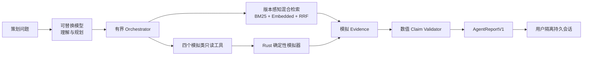

# 作品集案例：让 AI 做战斗策划实验，而不是编造数值

## 一句话定义

我为《剑网3》苍云战斗模拟器设计了一个证据驱动的分析 Agent：模型负责理解策划问题、检索版本资料、提出实验和解释结果；本地知识快照负责机制与攻略溯源，Rust 确定性模拟器负责当前场景的数值事实，服务端验证结论对应的版本、来源与实验。

## 问题与目标用户

战斗策划面对的不是“帮我写一段话”，而是开放问题与严格数值之间的矛盾：为什么这套循环表现异常、某个候选改动是否真的更好、结论能否复现。直接让大模型计算伤害会产生看似合理但不可验证的数字；直接暴露底层接口又会让工具空间失控。

目标用户是需要快速提出假设、比较方案并保留实验依据的战斗/数值策划。体验目标是让不了解代码的人在 90 秒内看懂：问题如何变成实验，数字从哪里来，系统在何时拒绝结论。

## 我的设计

关键取舍：

1. 模型不能访问任意 REST、文件或 shell，只能调用场景读取、版本知识检索、模拟、A/B 和时间轴诊断五个只读工具；
2. 单次 run 最多六轮模型、八次工具调用、两次知识检索、八次模拟预算、三个候选、六十秒，且每用户只有一个活动 run；
3. 报告中的数字不是普通文本字段，而是 `value + unit + evidence_id + json_pointer`；找不到证据就修复一次，再失败则降级；
4. SSE 展示规划、工具生命周期、证据产出、校验/恢复与终止阶段的固定概述，不展示隐藏思维链或 provider 原始 payload；
5. 当前、历史、体服和跨版本先由服务端硬过滤，再进行 BM25 + 本地中文向量的 RRF 融合；目录/标题年份冲突与仅元数据页面不能伪装成当前事实；
6. 报告中的资料超链由服务端从本轮 Evidence 派生，包含赛季、匹配状态、原始来源、语雀入口和文档哈希；
7. 会话采用不可变 meta 与 append-only 事件，崩溃后记录 interrupted，不自动重发外部请求，也不自动删除用户材料；新 run 同时保存服务端私有 replay，公开 API 只返回脱敏投影。

## 可交互结果

Agent 实验面板把工作过程压缩成五步：策划问题 → 模型规划 → 检索/模拟 → 证据校验 → 结构化结论。每个阶段显示目标、动作、证据或校验结果；失败结果可展开终止阶段、最后成功工具、预算、token、耗时、prompt 和稳定诊断码。用户还可以查看来源卡的赛季与可信状态，跳转原始页面或语雀目录，并复制包含 scenario、prompt、evidence 与来源链接的实验摘要。

默认 `offline` profile 不联网，可完整演示工具循环和安全边界。`openai_responses` 与 `openai_compatible_chat` adapter 已完成本地 mock 契约测试；DeepSeek V4 Pro 已通过兼容 profile 做真实评测。API key 只允许通过服务端环境变量注入。

## 当前量化结果

| 指标 | 当前结果 |
| --- | ---: |
| Rust 自动测试 | 185/185 |
| 本地知识快照 | 159 篇 / 3796 分块 / 13 个赛季目录 |
| 固定知识检索 Recall@5 | 24/24（100%，门槛 90%） |
| 知识版本/来源资格/拒答断言 | 32/32 |
| Embedded 混合检索状态 | hybrid_rrf / cache hit / 无降级 |
| Dense 增益对照 | BM25 Top 5 漏召回 → Hybrid Top 5 命中 |
| Embedded 固定集耗时 | 模型缓存命中；28 题共 3.50s |
| 版本越界与伪造来源进入报告 | 0 |
| 确定性工具评测 | 20/20 |
| Agent 模型层离线评测 | 12/12 |
| 已验证数值的 evidence 引用率 | 100% |
| 非法写工具暴露 | 0 |
| 离线评测 p50 / p95 | 11ms / 11ms |
| 离线 token / 费用 | 0 / 0 |
| 真实模型固定题集 | 1/10 → 6/10 → 5/10 复跑 |
| 真实评测越权工具调用 | 0 |
| 可计量开发费用 | 至少 USD 0.261493 / USD 0.70 总上限 |
| 真实多轮续接 | 1/1 完成并重新取证 |
| K5B 最终分层评测 | Pro 77.8* / Flash 92.6（6 题、零重试） |
| v13 领域 Playbook 高风险回归 | Pro 100 / Flash 91（4 类 × 双模型） |

浏览器在 1440×1000 下完成 Agent 深链、历史列表、信息层级和响应式布局验收。进程级测试验证了运行中 worker 被终止后，会话追加 `worker_restarted` 并恢复为 interrupted。

## 数据与部署边界

首次写入前，真实 userdata 有 178 个文件、863,482 字节，manifest SHA-256 为 `f4395818602446c985a0442eb6d8dbf082b445dec9767334d3024d75837d2e2a`。确认后新增一个 offline 作品集基线会话，共 11 个文件、6,344 字节；排除新增目录后，原 178 个文件的数量、字节数和 manifest 完全不变。

公网默认关闭。真实模型只由本机隔离进程调用，profile 为 DeepSeek V4 Pro 或 V4 Flash，开发费用硬上限为 USD 0.70。K5B 修复前有失败响应未返回本地 usage，费用数字只作为已计量下界，不冒充供应商账单。公开 Demo 之前仍需补 HTTPS、限流、用户配额和许可检查。

## 失败案例与反思

- 离线 fake provider 能证明协议、工具边界和证据链，却不能证明真实模型理解自然语言的质量；因此没有把 12/12 包装成“模型准确率”。
- 固定检索集首次运行发现“当前赛季加权”会给零词法重叠问题制造伪结果；修复为先满足词法相关性、再施加版本加权。20 个正例仍全部 Top 1，无答案问题稳定返回空结果。
- Embedded 首次真评测又发现乱码问题以 0.429806 相似度误召回宏文档；系统没有用 BM25 降级后的结果冒充 Dense 通过。最终采用 0.45 基础阈值、0.55 纯 Dense 入池门槛和加权 RRF。C-001 修订后，扩展集保持 24/24 与 32 条安全断言，并保留一条 BM25 Top 5 漏召回而 Hybrid 恢复的语义对照。
- 真实固定题集从 1/10 提升到 6/10，但复跑为 5/10，暴露了兼容接口输出格式和工具规划的随机波动。作品集同时保留三轮结果，不挑最好一次冒充稳定指标。
- `agent-system/v6` 把赛季和分类收紧为本地索引动态枚举；最多两次版本检索，达到上限后由 Orchestrator 移除工具并强制收束报告。知识证据只能解释机制和提出假设，当前数值仍必须来自模拟器。
- `agent-system/v7` 进一步把检索变成受控状态机：模型逐次检索，同轮冗余请求由服务端合并，达到上限后基于已有证据收束而不是报“预算耗尽”。人物、作者和来源身份可用 `reference_lookup` 跨赛季召回，但只能形成 `reference_only` 来源，不能证明当前版本玩法。
- `agent-system/v9` 把攻略阅读转化为战斗策划表达规范：报告区分观察、诊断和决策，并围绕伤害结构、资源/增益利用、时间结构与稳健性组织。客户端边界不只写在提示词里；问题涉及无界端时，服务端只暴露知识检索，模拟和候选工具不可调用，因此无界资料不会被包装成旗舰端模拟结论。供应商输出允许拆除 Markdown 等外包装，但内部证据协议不放宽；紧凑报告预算避免 JSON 因冗长被截断。
- `agent-system/v10` 将未声明客户端的问题确定性路由到“旗舰端 + 当前版本 + 当前心法”，并在 BM25/Dense 召回前排除无界和错误心法资料；显式无界问题仍进入纯知识问答。复制摘要同时补齐结论、建议和证据边界，避免应用层把完整报告压缩成一句话。
- `agent-system/v11` 不再让模型指定固定 `top_k`。服务端按问题意图、相关置信度和来源覆盖弹性选择证据；白皮书、实战、机制与宏是软排序信号而非固定配额，最多 8 篇仅作为资源安全上限。
- `agent-system/v12` 将数值校验拆成两条互不混用的证据通道：战斗数值继续绑定确定性模拟字段，攻略中的阈值、延迟和档位只能复述自该结论实际引用的可用资料片段。未引用或不可用于事实的资料不能放行数字，攻略数值也不会伪装成模拟指标。
- `agent-system/v13` 把攻略阅读固化成服务端领域层：任务先路由到基线、空转、加速、橙武、宏、副本、机制或来源 Playbook，再生成范围、阶段、必需证据与禁止推断。工具按任务和场景前提动态开放；副本与无界不暴露木桩实验，短循环和未装备橙武时也不制造伪 A/B。连续坏 JSON 时直接展示可溯源知识摘录，不让已取得证据变成无效对话。
- `agent-system/v14` 在循环分析中由服务端识别宏输入或手动序列，再把当前攻略、原始宏语句/手动操作点和本轮时间轴交叉验证。可执行改法使用独立结构输出：宏模式给出原句与完整替换语句，手动模式给出序列位置与具体按键/时序动作；缺少当前版本攻略或原输入证据时不会伪造修改方案。
- `agent-system/v15` 将领域 Playbook 与场景前提结合，允许循环任务在证据缺口明确时弹性进入时间轴或同场景候选实验；服务端仍用类型化 patch、预算和证据覆盖控制边界，而不是把固定工具次数写进提示词。
- `agent-system/v16` 直接把宏解析器的条件 AST、全括号语义和右结合规则交给模型，避免模型按通用语言优先级重组 `&`、`|`。同时明确“能解析”不等于“已证明运行效果”：宏行命中、前序抢占和 DPS 收益必须由时间轴或同场景比较支持。Golden 回归确认这一解释层增强没有改变原宏输出。
- K5B 同题零重试评测发现 V4 Flash 最终分层综合为 92.6，V4 Pro 修正后为 77.8；这不是模型准确率。Pro 仍有一次被服务端拦截的越权工具尝试，系统实际越权执行为 0。空响应不再抹掉整轮证据，而是降级保留来源且不补写结论。
- 语料迁移得到 161 条目录记录，运行时排除 2 个抓取失败条目，形成 159 篇文档、3796 个检索分块和内容寻址的 corpus hash。山海源流视频等仅元数据来源仍可被发现，但界面明确标成“仅来源入口”。
- 初版为阻止数值幻觉，禁止正文的所有阿拉伯数字，导致模型用中文数字复述精确值。`agent-system/v2` 改为校验“正文数值是否匹配已绑定 metric”：保留可读性，仍不接受无来源数字。
- 初版“恢复会话”只恢复记录，没有恢复语义上下文。真实验收前补为最近两轮可见报告的有界重建，并用真实续接 run 验证；隐藏推理和原始 provider transcript 仍不落盘。
- 瞬态 Run 不跨进程恢复。系统选择把它明确标为 interrupted，而不是猜测上游请求是否已执行并自动重试，避免重复费用和双写。
- 不使用全局会话索引，列表读取成本更高，但 MVP 避免了索引与事件不一致这一更危险的恢复问题。
- 第一版保留而不提供删除接口，符合本地作品集材料保留目标；未来归档/删除必须由用户显式触发并重新确认。

早期真实模型结果见 [`baselines/2026-08-26-agent-deepseek-v4-pro.md`](baselines/2026-08-26-agent-deepseek-v4-pro.md)，K5B 分层结果见 [`baselines/2026-08-27-agent-k5b-real-model.md`](baselines/2026-08-27-agent-k5b-real-model.md)，领域 Playbook 结果见 [`baselines/2026-08-28-agent-domain-playbooks-v13.md`](baselines/2026-08-28-agent-domain-playbooks-v13.md)，宏语义兼容回归见 [`baselines/2026-08-31-agent-macro-semantics-v16.md`](baselines/2026-08-31-agent-macro-semantics-v16.md)。下一步是补齐宏行命中与抢占观测，再用真实模型评测多轮实验规划质量。
