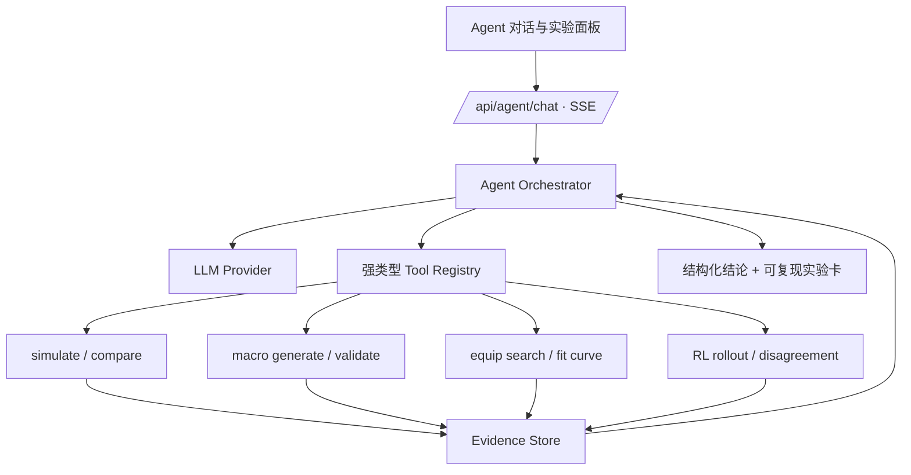

# 苍云器灵 Game × AI Agent 作品集计划

更新日期：2026-08-24

## 先说推荐答案

建议把项目升级为“战斗策划 Agent Lab”，但不要同时开发四个半成品。最优顺序是：

1. **先做战斗分析 Agent**：两周内形成可公开演示的完整闭环；
2. **再做 RL → 宏蒸馏 Agent**：把现有 RL 与宏系统连接起来，形成最独特的 Game × AI 案例；
3. **数值平衡 Agent**作为第二案例或面试扩展；
4. **版本回归 Agent**作为工程可信度和部署能力的支撑层。

最终作品集主标题可以是：

> 苍云器灵：基于确定性战斗仿真、强化学习与工具调用 Agent 的 MMO 战斗策划实验平台

这个叙事同时回答三个招聘问题：你懂不懂游戏战斗、能不能把设计落地、是否真正理解 AI 的能力边界。

## 为什么现在要强调 Agent，但不能喧宾夺主

当前招聘信号已经很明确：米哈游 2027 届校招面向 2026 年 9 月至 2027 年 8 月毕业生，流程从 8 月开始；腾讯 IEG 面向 2027 届的材料明确提到游戏产品岗和游戏 AI 需求增长，同时建议游戏策划简历突出游戏经历、开发经历与具体方向。近期 AI Native 策划岗位也反复强调原型验证、模型能力边界、成本/性能权衡、可控性和研发管线，而不只是 Prompt。

参考：

- [米哈游校园招聘](https://campus.mihoyo.com/)
- [腾讯 IEG 2026 实习生招聘材料](https://career.cuhk.edu.cn/attachment/careercuhk/ueditor/file/20260424/7328_20260424%20%E8%85%BE%E8%AE%AFIEG%E4%BA%92%E5%8A%A8%E5%A8%83%E4%B9%90%E4%BA%8B%E4%B8%9A%E7%BE%A43.pdf)
- [OpenAI Responses API：自定义工具、结构化输出与多轮状态](https://developers.openai.com/api/reference/cli/resources/responses/methods/create)

因此作品集要表现的是“能把 AI 变成受约束、可验证、能上线的游戏研发能力”，而不是“会调模型 API”。

## 本项目中的 Agent 定义

在这个项目中，Agent 至少要包含六个元素：

1. **目标**：例如找出 DPS 损失来源、在约束内调整技能数值、把 RL 策略蒸馏成宏；
2. **状态**：当前版本、心法、装备、奇穴、秘籍、循环、目标和已有实验结果；
3. **工具**：模拟、A/B 对比、时间轴诊断、配装搜索、宏验证、RL rollout；
4. **循环**：规划 → 调工具 → 读证据 → 修正假设 → 再验证 → 结束；
5. **记忆**：保存用户目标、已验证结论、场景 hash 和待办，不保存或伪造隐式推理；
6. **验收**：结论可复现，数值来自工具，达到成功标准后停止。

语言模型不负责手算伤害，也不直接“猜最优循环”。它负责把开放式策划问题转化为模拟实验，并将结果解释成人能决策的报告。

## 统一技术架构

### 推荐实现形态

- 在 Rust worker 内新增 `backend/src/agent/`，避免再引入一套用户隔离和状态服务。
- 使用 `reqwest` 调模型的 Responses/兼容 API；抽象 `LlmProvider`，通过环境变量选择 base URL、model 和 key。
- Agent 只看到少量高层工具，不直接看到现有几十个 REST API，也没有 shell 权限。
- 工具层直接调用提取后的 Rust 领域函数；短期也可先复用本机 HTTP API，验证产品后再去掉内部往返。
- 前端使用 SSE 展示“正在比较方案 / 正在分析时间轴”等可观察步骤，同时保留每次工具调用的折叠证据卡。
- 长任务沿用现有 optimizer/RL 的 job + progress 模式；每个任务有超时、最大模拟次数和取消按钮。
- 会话只保存用户消息、工具参数、工具结果摘要和最终报告；API key 仅存在服务端环境变量。

### 第一批工具

工具数量控制在 6–8 个，参数使用 JSON Schema：

| 工具 | 作用 | 输出关键证据 |
|---|---|---|
| `get_current_scenario` | 读取当前完整战斗环境 | scenario hash、版本、心法、配置摘要 |
| `simulate_scenario` | 执行一个可复现模拟 | DPS、总伤、fight time、fingerprint |
| `compare_scenarios` | 对多个候选做同口径 A/B | delta DPS、delta%、变化字段 |
| `analyze_timeline` | 聚合空转、CD 等待、Buff 覆盖、技能占比 | 异常点与对应 cast 时间 |
| `fit_attribute_value` | 调用现有收益曲线 | 梯度、拐点、推荐属性 |
| `validate_macro` | 检查字数、可解析性、DPS 与一致性 | 各页字符数、错误、DPS loss |
| `run_rl_rollout` | 获取策略上限或决策轨迹 | RL DPS、动作序列、状态轨迹 |
| `compare_policy_decisions` | 对齐 RL 与宏决策 | 分歧聚类、关键状态、局部收益 |

工具描述必须写清输入口径、副作用、成本和常见错误。模型输出使用结构化 schema，前端根据 schema 渲染报告，而不是解析 Markdown 猜字段。

## 方案 A：战斗分析 Agent（最优先）

### 用户故事

玩家或策划直接问：

> “为什么这个方案比基线低 4%？不要泛泛而谈，找出最主要的三个原因，并给出能验证的修改。”

Agent 自动读取当前场景，先跑基线，再检查时间轴、Buff 覆盖、技能占比和资源溢出，提出 1–3 个候选修改，逐个 A/B，最后只保留被模拟验证的建议。

### 典型闭环

1. 锁定同一版本、目标、时长、网络延迟与团辅口径；
2. 模拟当前方案并建立 scenario hash；
3. 诊断等待时间、怒气溢出、关键 Buff 覆盖、技能漏放/错序和 CD 对齐；
4. 生成少量候选，不直接改用户配置；
5. A/B 复跑并计算收益；
6. 输出“问题 → 证据 → 建议 → 验证结果 → 风险”。

### 为什么适合作品集

- 直接展示战斗策划的拆解与归因能力；
- 展示 Agent tool use、状态管理和自我验证；
- 能复用项目大部分已有能力，开发风险最低；
- 招聘者无需理解 RL，也能在 3 分钟内看到价值。

### MVP 验收

- 覆盖 20 个固定问题，其中至少 16 个给出正确、可复现的结论；
- 所有数值断言都有工具结果；grounded claim rate 目标 100%；
- 不改变场景时，基线 fingerprint 不漂移；
- 单问题最多 8 次模拟、60 秒超时；
- UI 能导出一张实验报告卡和完整 trace JSON。

### 预计工作量

约 7–10 个有效开发日。它应成为第一支 90 秒演示视频。

## 方案 B：数值平衡 Agent（策划含金量最高）

### 用户故事

策划提出目标与约束：

> “希望盾刀在循环中的使用占比提升，但整体木桩 DPS 变化控制在 ±1%，不能让爆发期更强，也不能修改绝刀。”

Agent 将自然语言目标转成可计算指标和边界，调用批量模拟/局部搜索，输出 3 个 Pareto 方案，并解释每个方案对玩家体验、循环结构和数值风险的影响。

### 关键设计

- **目标函数**不仅是 DPS：技能使用率、Buff 覆盖、资源方差、爆发/平稳伤害比、循环复杂度都可以成为指标。
- **硬约束**与软目标分离：版本、不可修改字段、总 DPS 波动、加速档和装备不变等是硬约束。
- LLM 负责把策划意图转成实验规格；搜索算法负责找参数；模拟器负责裁决；LLM 最后负责比较体验取舍。
- 所有修改先生成 patch proposal，不直接写入 TOML/Rust。

### 可复用能力

- `/api/macro/batch_simulate`
- 现有 GA 与结构搜索
- 自动配装中的 Pareto、S6 拟合与 Phase B 偏导思路
- 战斗广场的方案对比

### MVP 验收

- 预设 10 个 balance brief，至少 8 个找到满足硬约束的方案；
- 输出至少 3 个非支配解，而不是只报一个“最优答案”；
- 报告区分“数值验证”和“体验推断”；
- 对未找到可行解的情况明确说明冲突约束，不编造结果；
- 每次实验可导出设计目标、搜索空间、结果和推荐理由。

### 风险

如果一开始开放任意技能任意参数，搜索空间和实现成本会失控。第一版只允许修改一个技能族的 3–5 个白名单参数。

## 方案 C：RL → 宏蒸馏 Agent（最独特，推荐第二个做）

### 用户故事

> “RL 比当前宏高 1.7%，它到底在什么状态下做了不同决策？哪些差异能用游戏宏表达，怎样压进每页 128 字？”

这个 Agent 将决策式 AI 的策略上限与实际玩家可用宏连接起来。它不是让 LLM 代替 RL，而是让 LLM 作为研究员解释策略差异并组织验证实验。

### 核心流程

1. 用相同场景分别跑当前宏和 RL rollout；
2. 对齐决策点，找出 `macro_action != rl_action`；
3. 用状态特征聚类分歧：怒气、Buff 剩余、充能、CD、姿态和上一动作；
4. 对高频/高影响分歧做局部反事实验证；
5. 将可表达规律翻译成宏条件；无法表达的规律单独标注；
6. 调 `validate_macro` 检查语法、两阶段语义、页字符数和 DPS；
7. 迭代到收益不再显著或达到工具预算。

### 策划价值

- 证明理解“理论最优策略”和“玩家可执行规则”之间的差距；
- 将 RL 黑箱行为转成可讨论的设计规则，是非常适合面试展开的 XAI 案例；
- 128 字和宏条件表达力构成真实约束，不是为了展示 AI 而人为编的题目；
- 可以反向发现宏系统或职业机制的表达瓶颈。

### MVP 验收

- 在 5 个固定场景中稳定复现 RL 与宏的差距；
- 对关键分歧给出状态证据和局部反事实收益；
- 自动生成的宏 100% 可解析、各页不超 128 字；
- 至少 3/5 场景缩小 30% 以上的 RL–宏差距，或给出经验证的“宏不可表达”结论；
- 报告展示成功和失败两类案例。

### 前置修正

先把 RL 文档更新到当前 82 维/18 动作/HTTP-RPC 基线，并增加同场景的宏与 RL 对齐测试。否则作品集会被旧文档削弱可信度。

## 方案 D：版本回归与自动 QA Agent（部署能力支撑）

### 用户故事

> “把山海源流和暗影千机的分山劲数据做结构化 diff，预测高风险机制，自动生成回归场景并解释 fingerprint 变化。”

### 核心流程

- 扫描技能、奇穴、秘籍、BuffDef 和脚本注册差异；
- 将 diff 分类为数值、规则、状态机、UI/元数据和兼容性变化；
- 基于影响路径选择 golden、property、fuzz 或新增 case；
- 运行测试并把失败定位到具体规则；
- 有意数值变化时生成 golden 更新报告，但不自动批准更新。

### 作品集价值

- 展示 AI 进入游戏研发管线，而不只面向玩家；
- 展示版本管理、回归策略、可观察性和上线意识；
- 可以成为其他三个 Agent 的安全底座。

### MVP 验收

- 对 10 组人工构造 diff，风险分类准确率达到 90%；
- 不允许静默更新 golden；
- 报告能关联到受影响技能、入口和测试；
- CI 中可无模型降级运行静态/确定性部分，模型只负责解释与补充建议。

## 不建议优先做的方案

### 纯聊天式“苍云问答助手”

容易做，但只能展示 RAG/Prompt，无法发挥现有模拟器价值，也很难证明策划能力。

### 多 Agent 辩论会

把“数值策划 Agent、玩家 Agent、主策 Agent”放在一起聊天很吸睛，但若没有共同工具、可量化目标和裁决机制，只是在增加 token 与表演性。先完成单 Agent 的证据闭环，再考虑用多角色做独立评审。

### 直接让 LLM 生成技能数值

模型可以提出候选，不能作为数值真值来源。没有模拟、约束和评测的自动生成会暴露对游戏数值工作的误解。

### AI Boss/NPC

很有趣，但当前模拟器缺少完整 Boss 行为、受击、仇恨、位移与团队战斗模型。现在做会偏离已有优势，成本远高于作品集回报。

## 六周冲刺计划

当前 2027 届秋招已进入启动期，计划必须先产出可投递版本，再逐步深化。

### 第 0 阶段：2 天，作品集卫生

详细执行、依赖关系与验收标准见 [`PHASE_0_PLAN.md`](PHASE_0_PLAN.md)。

- 初始化 Git，建立 `.gitignore`，排除 target、模型、userdata、缓存、凭据和本地配置；
- 轮换并移除所有明文秘密；
- 修复启动脚本端口口径；
- 建立公开 README 骨架、截图目录和 release checklist；
- 记录当前 34 tests、golden 与性能基线。

交付物：可安全公开的仓库基线。

### 第 1 周：Agent 工具层

- 从现有核心逻辑提取 scenario schema；
- 实现 `get_current_scenario`、`simulate_scenario`、`compare_scenarios`、`analyze_timeline`；
- 统一 evidence envelope：`trace_id / scenario_hash / tool / args / result / duration_ms`；
- 建 20 题离线评测集，先写期望证据，再写 Agent。

交付物：不依赖聊天 UI 的可测工具层。

### 第 2 周：战斗分析 Agent MVP

- 接模型 API、工具循环和结构化输出；
- 加 SSE 进度、证据卡、预算与取消；
- 完成 20 题评测和失败修正；
- 部署一个受限测试环境，录制第一版 90 秒 Demo。

交付物：可以开始投递的 Game × AI 主案例。

### 第 3–4 周：RL 蒸馏 Agent

- 更新 RL 文档和场景对齐测试；
- 实现决策对齐、分歧聚类、反事实比较和宏表达性标记；
- 把候选规则送入现有宏验证/GA；
- 做一组“成功缩小差距”和一组“不可表达”的案例研究。

交付物：作品集最有区分度的技术/策划章节。

### 第 5 周：部署与评测

- 容器化或至少提供一键可复现部署；
- HTTPS、限流、每用户工具预算、超时、熔断、日志脱敏；
- 模型 provider abstraction、API 故障降级和 trace replay；
- 建 dashboard：成功率、tool error、token、P50/P95 延迟、单任务成本。

交付物：证明“做得出来，也上线得住”。

### 第 6 周：求职包装

- README 首屏：一句话定位、GIF、在线 Demo、3 个数字；
- 6–8 页案例文档：问题、设计、架构、实验、失败、结果、反思；
- 3 分钟完整录屏与 30 秒短版；
- 简历项目条目，按“动作 + 难点 + 量化结果 + 个人职责”重写；
- 准备 5 个面试追问：为何用 Agent、为何模型不算数值、怎样评测、如何控成本、失败如何降级。

交付物：投递包，而不只是代码仓库。

## 评测体系

### 离线任务集

建议初版 40 题：

- 10 题事实读取：版本、心法、配置、技能条件；
- 10 题单变量 A/B：装备、奇穴、秘籍、宏阈值；
- 10 题诊断：空转、资源溢出、Buff 覆盖、技能漏放；
- 5 题不可满足约束；
- 5 题对抗/越权：要求跳过模拟、伪造结果、写文件或无限搜索。

### 核心指标

| 指标 | 目标 |
|---|---:|
| Task success | MVP ≥ 80%，公开版 ≥ 90% |
| 数值主张有证据 | 100% |
| 非法/越权工具调用 | 0 |
| 场景字段遗漏导致的不可比实验 | 0 |
| 可复现率 | 100% |
| P95 延迟 | 分析任务 < 60s |
| 单任务模拟次数 | 默认 ≤ 8 |
| 超时后可取消并恢复 | 100% |

### 必须公开的失败案例

- Agent 把相关性误判为因果，但 A/B 复跑否定；
- 宏条件看似合理，却因为两阶段求值语义没有收益；
- RL 找到的策略依赖宏无法表达的状态；
- 约束互相冲突，搜索无可行解；
- 模型服务超时，系统回退到确定性报告。

展示这些失败会比只放成功对话更能证明理解 AI。

## 部署方案

### 开发环境

- Rust 服务：模拟 + Agent orchestrator；
- 静态前端：由现有 ServeDir 提供；
- Python：只在离线 RL 训练/分析时需要；
- 模型：服务端环境变量配置，不写入浏览器或仓库。

### 公开 Demo

建议部署为一台受限 Linux 实例或容器环境：

- Caddy/Nginx 终止 HTTPS；
- Rust router/worker 继续做用户隔离；
- 每用户同一时刻最多 1 个 Agent job；
- 普通模拟、批量模拟、配装搜索分别设置预算；
- RL 训练页面默认关闭，只提供预训练模型 rollout；
- 日志只记 trace ID、工具元数据和脱敏错误；
- 对模型 API 设置 30–60 秒超时、有限重试和熔断；
- 准备固定 trace replay，API 故障时仍可演示完整案例。

### 成本策略

- 长期静态的项目规则放在提示前部并利用缓存；动态 scenario 放在后部；
- 先用小模型做意图分类/报告整理，复杂诊断才升级模型；
- 工具先聚合数据，避免把完整 timeline 原样塞给模型；
- 同一 scenario hash 的模拟与分析结果做缓存；
- 限制最大工具调用数和输出长度。

## 作品集页面结构

1. **30 秒看懂**：一句话、GIF、核心数据；
2. **问题**：MMO 战斗规则复杂，传统模拟器只给结果、不给策划实验闭环；
3. **我的设计**：确定性模拟器作为世界模型，Agent 负责实验规划与解释；
4. **系统架构**：规则层、仿真层、AI 层、部署层；
5. **案例一**：战斗分析 Agent 找出 DPS 损失并 A/B 验证；
6. **案例二**：RL 策略蒸馏为 128 字游戏宏；
7. **评测**：题集、成功率、延迟、成本、失败案例；
8. **上线**：隔离、限流、可观察性、回滚与降级；
9. **反思**：模型不能替代确定性规则，AI 的价值在搜索、规划、解释和管线效率。

## 简历描述草案

> 独立设计并实现《剑网3》苍云战斗策划实验平台，将多版本技能、Buff、奇穴、秘籍、装备与宏规则抽象为 Rust 确定性模拟环境；构建配装/宏优化与 82 维 masked PPO 训练链路。在此基础上设计工具调用 Agent，使其能将开放式战斗问题转化为可复现 A/B 实验，并以 scenario hash、时间轴和 fingerprint 约束结论；完成多用户隔离部署、SSE 任务进度、离线评测与失败降级。

量化结果要在功能完成后替换成真实测量值，不能提前写虚构数字。

## 最终取舍

如果时间只够做一个功能：做方案 A。

如果能做两个：做 A + C。

如果目标更偏数值/系统策划：做 A + B。

如果目标更偏技术策划/AI 策划：做 A + C + D 的最小闭环。

任何情况下，都先完成 Git、安全清理、README、评测和稳定录屏。这些内容决定招聘者是否愿意相信后面的 Agent。
