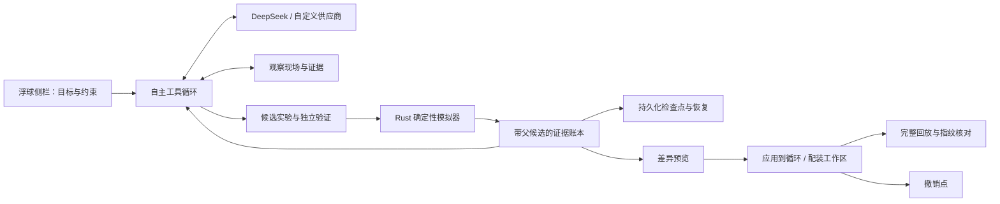

# 苍云武学助手：自主实验 Harness v2

面向需要把技能轴变成宏、比较循环或选择装备的苍云 PVE 玩家。目标是让玩家提出问题后获得**能重放、能比较、能应用、能撤销**的候选，而不是只得到一段建议。新助手与原 AI 分析并行，统一放在可拖动悬浮球与可调整大小的侧栏中。

## 与原 AI 分析的区别

v2 不调用原 `AgentOrchestrator`，不按“写宏 / 循环 / 配装”路由到固定工作流。`run_loop.rs` 只负责预算、模型交互、工具执行与证据记账。模型可从任何已有候选分支，自行写宏、写技能序列或给出完整装备，随时观察失败现场、换方向、再验证。循环与配装搜索是可选实验算子。

共享的是已有供应商传输适配器、冻结数据读取与确定性模拟器；伤害仍只由 `simulate_core` 原计算链产生。用户目标和模型文本不会获得 shell、任意文件或外网执行权限。



## 实验协议

| 工具 | 能力 |
| --- | --- |
| `inspect` | 冻结场景、技能定义、宏语法、分页时间轴、候选证据、装备目录。只读且不占模拟次数。 |
| `experiment` | `evaluate` 直接验证自拟宏 / 技能轴 / 完整配装；`compile_macro` 还原目标轴；`search_rotation` 搜索可运行输出宏；`optimize_equipment` 重算完整配装并搜索；`validate` 改变延迟 / 随机种子做留出实验或明确标注同场景复跑。 |
| `record_learning` | 保存绑定证据的观察；任务恢复后仍可读取，不自动修改全局提示词。 |
| `finish` | 选择已有候选或交付明确缺口；不允许引用不存在的证据，正文数值需有实验支撑。 |

`parent_id` 可以引用任意已测试候选。配装 → 循环、循环 → 配装，以及退回较早分支重新试验都由模型选择。假设文字不参与实验缓存键；等价调用复用证据。输入拒绝与真实模拟失败都作为反例返回，已消耗次数不会丢失。

观察结果也进入任务记忆。不可变技能、语法和目录查询复用缓存；场景与证据分页始终读取最新状态。技能默认给出紧凑目录，按完整名称或 ID 读取详细定义；候选默认给出指标摘要，可分层读取模拟参数、配装和失败诊断，时间轴独立分页。完整原始证据仍保留在实验包中。

上下文压缩保留最近完整的工具调用及返回，再补充有界语义账本；较早分支可通过 `inspect/evidence` 分页找回。报告中的未经数值证据支持的句子会被移除并披露，文案问题不会把已经验证的候选拖入反复改写循环。候选是否通过仍由实测结果决定。

`verified` 只代表候选通过相应可执行性约束；`reproduced` 才表示宏还原通过动作、时间与可观察资源状态对齐。独立验证明确返回验证环境、是否可公平比较、是否实际改善。同环境复跑不能冒称留出验证。有限搜索没有全局最优证明。

## 配装与循环规则

- 配装从完整 12 槽、精炼、镶嵌、大小附魔和五彩石重算属性。模型不能直接写一个“高 DPS 属性面板”绕过装备校验。
- 版本、心法、部位、来源、装备 ID 白名单、品级、锁位与加速上下限均在 Rust 执行前校验。未知价格保持未知，不捏造可获得性或造价。
- 配装搜索保留原精炼、镶嵌和附魔；完整自拟装备可经同一准入工具验证。小候选池预算足够时穷举；大候选池用有界搜索并明确未穷尽。
- 纯宏按同一启动时间窗口运行，保留引擎真实结算时长。手动轴按完整同一动作序列比较，保留通道、偏移与预释放；加速造成的真实时长变化属于该策略结果。两类比较不能直接横向宣称提升。
- 循环搜索保留完整团辅、阵法、目标、装备、延迟、秘籍、奇穴与预释放环境，并预留不同延迟的成对验证预算。

## HTTP 与工作区 API

| 端点 | 用途 |
| --- | --- |
| `GET /api/harness/capabilities` | 当前工具 JSON Schema 与运行时能力。 |
| `POST /api/harness/runs` | 提交 `goal`、`provider_profile`、完整 `simulation`、`version`、`mount`、可选 `equipment`、约束与预算。 |
| `GET /api/harness/runs` | 当前用户最近实验。 |
| `GET /api/harness/runs/:id` | 最新状态与证据投影。 |
| `GET /api/harness/runs/:id/events` | SSE 最新快照；支持断线后重新读取。 |
| `GET /api/harness/runs/:id/artifacts` | 可复现实验包，包括完整请求与候选。 |
| `POST /api/harness/runs/:id/cancel` | 协作式停止；等待正在执行的模拟退出后释放计算占用。 |
| `POST /api/harness/runs/:id/resume` | 用剩余预算继续；构建身份变化时拒绝混用旧证据。 |
| `POST /api/harness/runs/:id/apply` | 用 `artifact_id` 和 `expected_scenario_hash` 生成应用事务、差异和撤销点。 |
| `POST /api/harness/runs/:id/undo` | 用 `transaction_id` 生成对应反向事务。 |

循环与配装的当前编辑状态位于浏览器。服务器 `apply` 返回 `prepared` 事务，**不把准备成功假称为已写入**。`Jx3HarnessWorkspace.apply` 校验当前内容未改变后实际写入编辑器、重算配装并回放核对；失败回滚。`undo` 也校验应用后的工作区未再被编辑，防止覆盖后续操作。

编辑器无法无损表示的特殊分页会在预览阶段明确拒绝写入，可导出完整宏继续使用。不会悄悄合并宏页或改换体态顺序。

## DeepSeek、恢复与部署

默认选可用 DeepSeek Flash，其次其他可用 DeepSeek。复用原模型设置入口，支持服务端环境变量及 worker 内存中的用户自定义 Key。模型 ID 由供应商配置决定，不在业务工具里硬编码。`offline` 只是显式协议 fixture，仍执行真实模拟器，不能作为真实模型能力证明。

DeepSeek 工具续轮所需的 `reasoning_content` 只在活跃请求内暂存并回传该供应商；不进入实验包、磁盘检查点或界面。任务恢复从语义证据重建上下文。

每个 worker 在自己的 `JX3_USERDATA_DIR/harness_runs/v2` 下增量保存不可变证据和原子检查点。不会迁移或重写 `agent_sessions/v1`。证据正文只保存一次；检查点引用它们。忽略未完成的临时写入；若最新检查点损坏，读取此前完整检查点。中断的预留模拟次数保守计入，不能靠重启绕过预算。目录达到配额或写盘失败会停止新增计算并提供导出。

默认预算为 16 次模型调用、192 次模拟、240 秒、单轮输出 8,192 Token 与 192,000 个累计 Token；界面可调。工具反馈与每轮系统指令均提供当前预算，并按近期输入规模估算验证与交付需要的余量，提前提醒收尾；这不规定工具执行顺序。重复上下文从语义账本压缩重建。Token 使用量依据供应商回报在每轮结算；到达阈值后不再发起下一轮。输出截断与网络中断分别提示，已有证据保留。参数体积、模拟窗口和并发任务均有限额。取消不提前释放仍有模拟在执行的占用。原优化器、RL 重计算和新 Harness 共用启动互斥。

发布前运行项目 Rust 回归、旧 Agent 20 题工具评测与 12 题模型离线评测，以及下面的 Harness 评测。使用隔离 worker，避免测试写入真实用户目录：

```powershell
cd backend
cargo test
cargo build --release
cd ..
node tools/harness-ui-test.js
node tools/harness-run-ui-test.js
python tools/harness-smoke.py --base-url http://127.0.0.1:3319
python tools/harness-run-smoke.py --backend http://127.0.0.1:3319
python tools/harness-run-smoke.py --backend http://127.0.0.1:3319 --profile deepseek-v4-flash
python tools/harness-run-smoke.py --backend http://127.0.0.1:3319 --profile deepseek-v4-flash --cases joint
python tools/harness-run-ui-smoke.py --backend http://127.0.0.1:3319 --isolated-worker
```

服务端凭据沿用 `JX3_AGENT_CONFIG` 指定的供应商配置和该配置引用的环境变量；不要将含 Key 的文件打包。公开部署仍需 HTTPS、鉴权、用户隔离与入口限流，不能直接恢复旧的裸 HTTP 公网链路。本次开发验收不等于授权公开部署。

本地交付使用 `python tools/package-harness.py` 生成 Windows ZIP，解压后运行 `start.cmd`。包内只含可执行程序、前端、运行时配表、无密钥供应商模板与说明；不含原始资料、私有知识库或既有用户数据。浏览器里的“模型设置”可以配置用户自己的接口，或者在启动环境中设置模板指定的 `JX3_DEEPSEEK_API_KEY`。首次启动没有预置 Key 属于正常状态。
