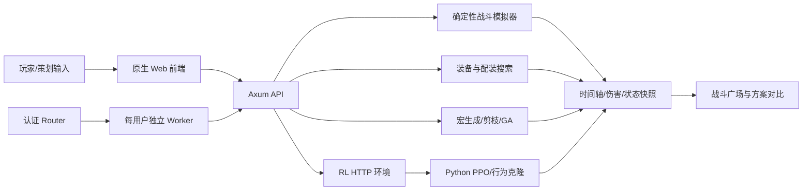

# 苍云器灵：项目现状基线

更新日期：2026-08-24

## 结论

这已经不是一个“伤害计算器”，而是一套围绕 MMO 战斗设计建立的策划实验平台。它同时具备规则建模、战斗仿真、配装搜索、宏生成与优化、强化学习、对比分析、用户存档和公网部署能力。

作品集最有竞争力的定位不是“我写了很多代码”，而是：

> 我把一个线上 MMO 职业的战斗规则抽象成可验证的模拟环境，并用优化算法、强化学习与工具调用 Agent 帮助策划提出、验证和解释设计决策。

建议主投方向：战斗策划、数值策划、系统策划、技术策划；Game × AI 是差异化标签，而不是替代基础策划能力的标签。

## 已核验的系统地图

### 战斗规则层

- 130 级苍云，覆盖分山劲 DPS 与铁骨衣坦克心法。
- 两个武学版本、四个版本×心法组合。
- 姿态、怒气、格挡、GCD、技能 CD、充能、连招、引导、Buff/Debuff、奇穴、秘籍、装备特效、团辅、阵法、预释放、网络延迟等状态均进入模拟。
- 伤害使用逐步取整的 9 段计算链；主动技能、触发事件、DoT/平砍和破招最终汇入同一计算路径。
- 数据与脚本分层：技能/奇穴/秘籍使用 TOML，复杂行为使用按版本组织的 Rust 脚本。

### 策划工具层

- 技能数值表与单次伤害计算。
- 手动循环和游戏宏模拟，包含时间轴、战斗记录、状态快照和 Buff 轨道。
- 宏的解析、两阶段求值、序列转宏、规则剪枝、阈值/结构 GA 搜索。
- 配装器、自动配装枚举、Pareto 剪枝、Hessian/属性收益拟合和精确 DPS 复核。
- 战斗广场：保存并横向对比“配装 + 奇穴秘籍 + 循环 + 环境”的完整方案。
- 与 jx3box、jx3dps-online 等外部格式的导入导出。

### AI/算法层

- 当前强化学习环境使用 18 个离散动作，其中两个槽位为兼容旧 checkpoint 而禁用。
- 当前观测为 82 维，包含资源、姿态、CD、充能 one-hot、自身/目标 Buff、连招、时间、GCD 和上一动作。
- Rust 后端通过 HTTP-RPC 暴露 Gymnasium 环境；Python 侧实现自研 masked PPO、行为克隆预训练、训练、分析与 checkpoint。
- RL 与宏共用 `execute_cast` 等核心路径，目标是保证训练环境与实际模拟语义一致。
- 已存在 RL 与宏的决策对比、rollout、训练/预训练/分析状态与 SSE 接口。

### 部署层

- 同一个 Rust 二进制支持普通服务、worker 和 router 三种运行形态。
- router 负责认证、反向代理、worker 健康检查、预热和空闲回收。
- 每个用户名对应独立 worker 进程和 userdata 目录，能够隔离内存状态与用户存档。
- 现有发布方式包括 frp 中转和 Cloudflare Quick Tunnel 备用链路。

## 工程规模快照

以下数据来自 2026-08-24 本地文件统计，只表示规模，不代表质量：

| 项目 | 数量 |
|---|---:|
| Rust 源文件 | 116 |
| Rust 行数 | 25,323 |
| 技能 TOML（含模板/版本重复） | 245 |
| `frontend/app.js` | 25,834 行 |
| `frontend/style.css` | 10,441 行 |
| `frontend/index.html` | 2,537 行 |
| Python 行数 | 1,475 |
| 后端数据文件 | 274 |

体量最大的模块是：

- `backend/src/main.rs`：9,567 行；
- `backend/src/equip.rs`：2,545 行；
- `backend/src/macro_gen.rs`：1,165 行；
- `backend/src/macro_eval.rs`：888 行；
- `backend/src/optimizer/struct_ga.rs`：871 行。

## 验证结果

本轮基线检查结果：

- `cargo test`：34 passed，0 failed；
- `node --check frontend/app.js`：通过；
- Rust 编译产生 17 个 warning，主要是 unused import/variable、dead code 和不必要括号；
- 尚未在本轮启动服务执行 golden fingerprint 与浏览器端完整工作流回归，因为本轮没有修改战斗业务代码。

现有正确性防线包括：

- Player setter property tests；
- 脚本禁止直接写状态的静态守卫；
- 4 组 golden fingerprint；
- Full/Lite 一致性与确定性检查；
- 随机宏 fuzz；
- 300 秒绝云宏的性能基线。

## Claude Code 记忆迁移审计

### 已迁移为稳定规则

- 项目目标、技术栈和版本×心法边界；
- 伤害计算与状态修改的不变量；
- Buff/Recipe/脚本扩展约定；
- 模拟请求环境完整性；
- 验证命令与 golden 更新原则；
- Agent 的“模型规划、模拟器裁决、证据驱动”原则。

这些内容现在位于根目录 `AGENTS.md`。

### 已迁移为项目技能

原 `.claude/skills` 下四个工作流已转换到 `.agents/skills`：

- `add-skill`
- `add-buff`
- `add-recipe`
- `add-talent`

转换时已删除旧的单版本路径假设，并要求先选定目标版本/心法、参考当前相邻实现和执行回归验证。

### 保留为按需参考

- `.claude/CLAUDE.md`：大量高价值机制说明，但行号和若干路径过期。
- `.claude/system_manual.md`：适合快速了解游戏规则和宏系统。
- `.claude/auto_optimize.md`：自动配装当前实现的主要专题文档。
- `.claude/macro_workflows.md`、`.claude/sequence_to_macro_v2.md`：循环蒸馏与宏工作流设计。
- `.claude/handoff_*.md`：历史阶段决策与踩坑记录。
- `.claude/scripts`：浏览器/CDP 自测与专项核验脚本。

### 明确降级为历史设计

- `.claude/auto_equip_design.md`：文档自身标注未实现，不能描述当前能力。
- `.claude/phase2_3_plan.md`：包含早期 GA 规划，其中部分已被现实现替代。
- `.claude/rl_system.md`：概念仍有参考价值，但架构、观测维度、动作数和通信方式已经过时。
- `.claude/CLAUDE.md` 中引用的多个 `.claude/memory/*` 文件并不存在，不能依赖。

### 未迁移内容

- Claude Code 的本机权限白名单、代理和模型设置；它们属于工具私有配置，不是项目知识。
- 运维文档和发布脚本中的秘密信息；它们必须在公开前轮换和移除，而不是进入新记忆。

## 当前主要问题

### P0：作品集与安全

1. 当前目录不是 Git 仓库，缺少可审查的演进记录。
2. 没有面向陌生读者的 README、架构图、快速体验路径和作品集案例页。
3. 运维手册、配置和脚本含明文凭据；公开前必须全部轮换，并用环境变量/秘密管理替代。
4. 当前公网入口使用裸 HTTP，且安全文档已指出限流、最小权限、错误脱敏等工作未完成。

### P1：工程可维护性

1. `main.rs`、`app.js`、`style.css` 均为超大文件，新增功能的回归面很大。
2. `start.bat` 中前端启动端口与最终提示/打开地址不一致，且与后端自身静态文件服务并存，启动口径不统一。
3. 文档、注释与代码存在漂移，例如旧版本名称、旧行数和旧 RL 架构。
4. 当前 Cargo 测试虽通过，但 warning 较多，公开项目会影响第一印象。

### P2：玩法与 AI 边界

1. Boss 受击侧逻辑仍有未实现项，现阶段更像玩家输出沙盘，而不是完整战斗服务器。
2. RL 主要覆盖分山劲离散技能决策，团辅、阵法、装备与部分特殊动作未完整进入环境。
3. 现有 AI 页面偏研发工具，尚未形成一个让招聘者 3 分钟内看懂的完整用户故事。
4. 缺少 Agent 专用的离线评测集、调用追踪、成本/延迟指标和失败案例库。

## 适合面试讲述的设计亮点

1. **同源仿真**：手动循环、宏、RL 和优化器共用战斗执行与伤害链，避免训练环境与产品环境漂移。
2. **规则与脚本分层**：数值数据可配置，复杂机制脚本化，支持多版本对比。
3. **可解释优化**：不仅给最高 DPS，还能通过时间轴、状态快照、属性收益和方案对比解释原因。
4. **约束内设计**：游戏宏有姿态页、条件表达力和 128 字限制，RL 理论上限与可执行宏之间形成真实的设计优化问题。
5. **工程化部署**：已有多用户进程隔离、健康检查、预热、回收、SSE 和用户数据隔离，能够继续承载 Agent。

## 下一份主文档

Agent 方案、推荐顺序、架构、评测、部署和 6 周作品集计划见 `docs/AGENT_PORTFOLIO_PLAN.md`。

