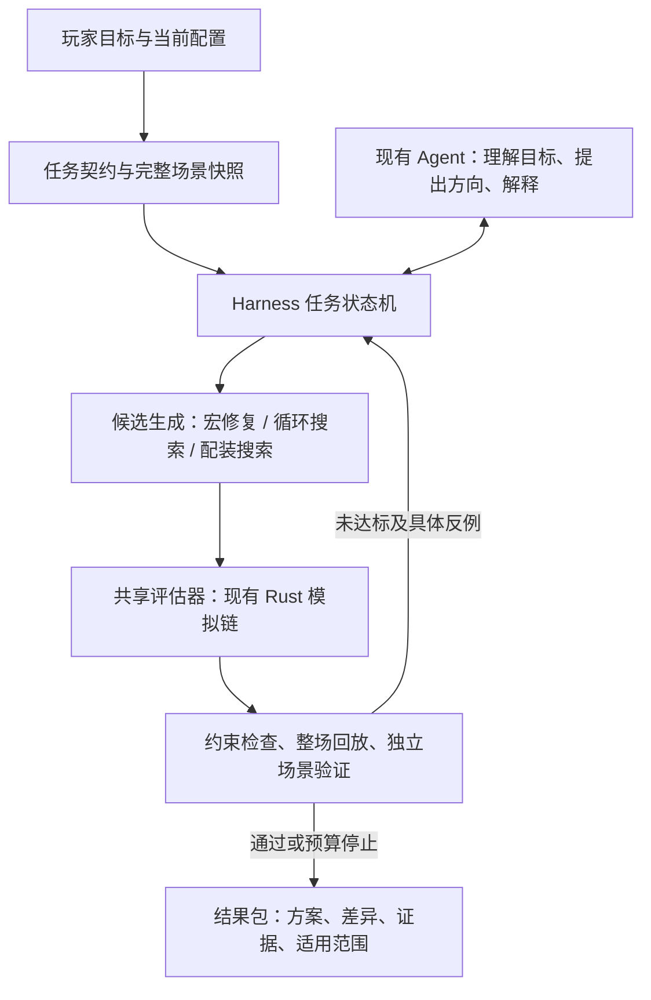

# 苍云 PVE 武学助手 Harness 设计与实现范围

日期：2026-09-21。状态：M0/M1 首版已实现，当前入口是独立“武学助手”页面和 `/api/harness/jobs`，与旧 AI 助手并行保留。首版执行“手动技能轴 → 生成宏 → 完整回放 → 分歧诊断 → 有界修复”，不调用模型 API，不创建 Agent 会话。

当前验收仅覆盖本次冻结场景、共同窗口内的主动动作身份/顺序、释放时间、档位/引导跳数及已采集的怒气、暴怒、格挡资源；不等同于全部气劲/冷却状态等价、跨场景泛化或游戏内验证。任务仅保存在当前 worker 内存，保留最近 8 个，可下载结果包；重启或淘汰后不保留任务，尚无检查点续跑。取消在模拟与候选计算之间协作检查，正在执行的一次计算会先结束。

自动配装、循环搜索、GA/RL 适配、模型规划及留出场景验证尚未接入。下文通用架构与 M2/M3 保留为后续设计，不能视为首版功能清单。实际请求、状态和复跑方式见 [Harness HTTP API](PVE_HARNESS_HTTP_API.md)。验证结果由本次发布基线另行记录，本文不将历史指标视作首版实测。

## 1. 产品目标

面向研究循环、编写宏和优化配装的苍云 PVE 玩家，把现有模拟器组织成可连续执行、可验证、可中断的实验工作台。

用户给出角色配置、目标与限制，系统建立基线、生成候选、运行模拟、诊断失败、迭代搜索，最后交付宏、技能轴或配装方案，以及它们在明确场景下的对比证据。语言模型负责需求理解、实验方向和解释；模拟器负责战斗事实；搜索器负责批量候选探索；Harness 负责状态、预算、验证和交付。

先服务三个明确任务：

| 任务 | 用户输入 | 交付 | 主要成功标准 |
| --- | --- | --- | --- |
| 技能轴转宏 | 完整角色环境、目标技能轴、允许的宏页数和条件 | 分页宏、逐处差异、未解决反例、适用范围 | 在指定窗口内还原目标动作，满足导出约束 |
| 循环搜索 | 基线循环、允许技能/奇穴/操作、场景集、计算预算 | 搜索得到的较优循环、可执行宏、提升原因 | 相同环境和预算下优于基线，并通过独立验证 |
| 自动配装 | 当前装备、候选库、锁定部位、获取限制、循环 | 若干完整配装、换装差异、收益与成本 | 所有硬约束通过，完整模拟收益可复现 |

循环搜索的结果称为“给定搜索空间和预算内发现的最好方案”。除非在有限空间完成穷举或具有可验证的最优性证明，不称为全局最优。自由技能轴、受宏语法约束的策略、以及玩家允许手动干预的策略分别排名。

用户已选择首版优先打通“技能轴 → 自动写宏 → 回放修正”。其结果反过来成为循环搜索和配装验证的可执行载体。后续配装与循环搜索的先后仍可调整。

## 2. 当前代码基础与接入边界

本节来自当前工作区代码阅读，未运行本次性能测试；历史测试数量和耗时不作为本方案的新测量结果。

| 当前部件 | 已有能力 | Harness 接入要求 |
| --- | --- | --- |
| `backend/src/agent/schema.rs` | 完整模拟输入快照、版本/心法身份、scenario hash | 复用；另外冻结目标、候选范围、验证集和算法配置 |
| `backend/src/agent/runtime.rs` | 在切换锁下冻结技能、秘籍、装备等运行时数据 | 所有任务使用同一冻结 runtime，不在运行中读取变化后的页面状态 |
| `backend/src/agent/evidence.rs` | 工具参数、结果、引擎身份、数据哈希 | 补齐实验身份，尤其装备库、奇穴、脚本构建和评分规则 |
| `backend/src/agent/run.rs`、`orchestrator.rs` | 模型工具循环、SSE、取消、会话、预算 | 复用 provider 和证据机制；批量搜索使用独立 Job，不依赖单次模型响应存活 |
| `macro_gen.rs`、`agent/distillation.rs` | 从实际轨迹生成宏，分页长度检查 | 作为候选种子；生成或解析成功不代表还原成功 |
| `macro_assist.rs` | 正负样本条件搜索、连续技能组合、联合规则候选 | 从可信模拟结果提取训练样本；静态命中率仅用于候选筛选 |
| `macro_diagnostic.rs` | 真实两阶段宏执行诊断、目标行条件与可释放性复查 | 提取可由后台任务调用的服务函数，按需记录有限窗口 |
| `frontend/macro-repair*.js` | 阈值、行顺序、关联行、组合修复及整宏复跑 | 复用规则与 fixture，将自动迭代能力移至服务端，页面继续支持人工编辑 |
| `agent/macro_tuning.rs` | 服务端删减、交换、阈值调整及模拟筛选 | 与写宏页面统一动作身份、比较窗口和评分契约 |
| `optimizer/`、`rl/` | 参数/结构搜索、训练与 rollout | 先校验环境一致性；搜索候选最终由共享评估器验收 |
| `equip.rs`、`agent/equipment.rs` | 配装计算、候选搜索、装备策略比较 | 保留确定性计算，扩展获取约束及与循环的联合验证 |

已确认的前置问题：

1. `agent/macro_tuning.rs::counts` 仍把普通月照、雁门归并为阵云；前端修复逻辑保留它们的独立身份。统一为版本/心法感知的技能身份和事件类型，不用字符串归并隐去真实分歧。
2. 服务端旧宏调优以释放次数和 DPS 为主要信号；相同次数并不保证顺序、时机或资源状态相同。轴还原必须另设验收标准，不能直接沿用它作为成功判定。
3. `optimizer/ga.rs::FitnessCtx::run_once_scen` 使用专用 Player 构造与输入字段，不承载完整 `SimulateRequest`。复用搜索算子前，核对每条实际入口的装备、团辅、阵法、预释放、版本/心法和特殊资源设置；不能假定旧搜索评分与主模拟一致。
4. 现有 `ToolProvenance::from_runtime_data` 的输入包含技能、秘籍、团辅、阵法和常量，但不直接覆盖装备库与奇穴表。单独的 scenario hash 或当前 data hash 不足以标识所有配装搜索实验。
5. 两套 GA 和 RL 环境均有直接调用 `Player::new` 的路径；该构造默认分山劲、暗影千机及分山常量。其他版本/心法的技能数据与此默认环境存在混用风险。接入时按版本、心法和动作覆盖声明支持能力；适配通过前只复用候选算法，不采信原评分作为最终证据。
6. 现有自动配装搜索重建请求时丢弃 `pauses`、`pre_releases` 等输入，且其 `baseline_dps` 来自固定部位，不一定是用户当前完整配装。Harness 应克隆完整冻结请求，仅替换合法候选字段，独立重算真实基线和收益。
7. 自动配装仍使用 worker 全局进度/控制状态；重复启动原本可能覆盖任务控制。首版已在 HTTP 接纳层为旧重任务和 Harness 统一互斥，阻止这一重入，但尚未将旧配装迁入独立 Job。最终装备方案仍需从完整槽位重新计算属性、完整复跑，不直接把增量或代理评分写成验收结果。

定位入口：`main.rs::Player::new`、`optimizer/runtime.rs` 中 `FitnessCtx`/`StructCtx` 构造、`rl/env.rs::EnvConfig`、`main.rs::AutoOptimizeRequest` 与 `auto_optimize`。这些是静态审计发现的接入风险；本轮未重新测量它们造成的数值偏差。

## 3. 执行架构

长期架构采用一个规划 Agent 配合多个确定性执行器。一次模型调用提出一个有边界的实验，例如“验证盾回提前是否改善这一段资源衔接”；执行器在预算内评估多条候选，模型读摘要和代表性反例。首版仅实现结构化任务与确定性执行器，旧 Agent 没有新增 Harness 调用工具。

首版实际模块位于 `backend/src/harness/`：`contract.rs`、`job.rs`、`http.rs`、`compiler.rs`、`repair.rs`、`alignment.rs`。后续通用化可按以下职责拆分，以下文件清单不是当前全部已存在的模块：

- `contract.rs`：任务目标、约束、场景集、预算、实验身份。
- `job.rs`：状态机、并发配额、取消、阶段进度、检查点。
- `evaluate.rs`：共享场景构造、缓存、预算记账、模拟与证据。
- `rotation.rs`、`macro_compile.rs`、`equipment.rs`：三类任务适配器。
- `validation.rs`、`artifact.rs`、`http.rs`：验收、交付与接口。

后续可在现有 `agent/` 增加少量强类型任务工具。首版由 `main.rs` 注册模块、路由、worker 任务管理器和重任务互斥；独立页面从现有手动技能轴读取完整配置，展示任务进度、宏页、对齐差异与结果包，不自动覆盖原宏或配装。

## 4. 一次实验必须冻结什么

建议定义 `ExperimentSpecV1`，所有字段由服务端验证：

| 字段 | 内容 |
| --- | --- |
| `task` | `compile_macro` / `search_rotation` / `optimize_equipment` |
| `scenario` | 复用 `ScenarioSnapshotV1`，包含完整装备效果、属性、奇穴、秘籍、目标、团辅、阵法、预释放、延迟、资源和停手配置 |
| `objective` | 轴还原或输出优化；明确结算窗口、必保动作/窗口、允许时间偏差 |
| `constraints` | 可改字段、宏条件集合/页数/长度、锁定装备、候选范围、玩家手动操作限制 |
| `search_space` | 技能/模板集合、装备候选集合、允许奇穴/秘籍变化；缺省保持用户配置 |
| `scenario_suite` | 搜索集、调参集、最终留出验证集及各自用途 |
| `budget` | 模拟次数、总墙钟、并发、内存/候选数上限；模型 token/调用预算单独记账 |
| `reproducibility` | 算法版本、搜索 seed、战斗 seed 集、引擎/脚本构建身份、各输入数据摘要 |

另计算 `experiment_hash`，覆盖以上规范化内容。每条候选拥有内容哈希和父候选 ID；每次验证绑定具体候选、完整场景、评估器版本及证据 ID。

缓存键至少覆盖候选内容、场景、运行时数据/构建、模拟随机种子和结果模式。轻量搜索结果不能冒充包含状态快照的诊断结果。若构建身份未知，标记复现限制，不把跨构建缓存视作有效证据。

所有候选复用同一计算链和完整环境。搜索用 lite 加速，入围候选用 full 复核；主模拟与搜索评分入口应有同请求一致性 fixture。比较双方需要相同伤害结算窗口；手动轴与宏时长尚未统一时，先报告动作差异，不给精确 DPS 增益。

## 5. 三条工作流

### 5.1 技能轴 → 自动写宏 → 反例修复

1. 在冻结场景重跑目标轴，取得真实主动施放、触发事件、状态快照和明确结算窗口；用户传入的旧时间轴仅作输入参考。
2. 用现有生成器与条件搜索产生种子，保留组合外同技能负样本；以完整宏为候选单位。
3. 整宏模拟，比较动作身份、顺序、时间、关键资源/增益状态和同窗口伤害。次数统计作为辅助指标。
4. 找到最早可信分歧，调用真实执行诊断，区分条件失败、不可释放、前行优先、当前页缺少技能及证据不足。
5. 将实际误触发/漏触发状态加入反例集，尝试调整条件边界、行顺序、关联两行或连续片段。每个候选从明确父版本产生，再完整复跑。
6. 在搜索集上选择候选，在独立场景中验证稳定性。用过验证结果来修复后，该场景已经参与调参，不再称为最终留出集。
7. 输出分页正文、原轴与实际轴对照、剩余反例和适用范围；未解决时保留最好已测方案并说明停止原因。

轴还原按以下优先级筛选：硬约束合法 → 必保动作/窗口通过 → 动作差异减少 → 时间/状态偏差减少 → 文本复杂度降低。用户选择输出优化时另用 DPS 目标，不能为提高 DPS 擅自放弃轴还原要求。

可表达性也属于结果：同一宏可观察状态可能对应不同期望动作，说明当前条件集合或页切换策略可能不足。只在完整定义的条件语言、观察范围和搜索边界内证明冲突；预算耗尽或启发式找不到解时返回“未找到”，不宣称“不可能”。需要手动爆发、切页或保留人工窗口时，列为显式方案限制。

解析通过、每页长度通过、在模拟器中回放通过、在已测试场景集通过、游戏内人工确认分别记录。导出页头和模拟专用指令不进入游戏用宏正文；实际支持的条件集合应作为有版本的导出契约校验。

### 5.2 推导较优循环

先从已有轴、预设和玩家方案建立基线，搜索局部顺序、资源阈值、爆发对齐与可释放窗口；再接入现有 GA/结构搜索。RL rollout 可提供新候选，训练作为后续独立高预算任务，不成为首版前置条件。

每轮同时记录：固定窗口 DPS、最差场景相对基线的收益、空转、资源溢出、关键技能延后、宏复杂度和手动操作要求。先满足硬约束，再按约定目标排序；如果展示多个取舍方案，保留不可互相全面取代的候选。

搜索与战斗随机性分开控制。每个候选使用相同场景/seed 集做成对比较；含随机触发机制时报告多 seed 分布，不能将固定单 seed 的赢家推广成稳定收益。多种战斗时长的离散场景结果也不能当作随机样本置信区间。

自由轴搜索结束后必须经过宏化和宏回放，分别展示自由轴收益、宏化损失与最终可执行策略收益。自由轴搜索结果只是参考方案，不是可证明的理论上限。

### 5.3 自动配装及与循环联合优化

约束包含：拥有/允许获取的装备、锁定部位、候选来源与品级、强化/附魔/五彩石可改范围、套装规则、属性要求，以及可选的金币或其他资源预算。价格和获取成本缺失时保留未知，不自动按零成本处理。

分层执行：合法候选过滤 → 快速估值缩小范围 → 完整配装计算 → 共享模拟器排序 → 入围方案全量验证。属性权重只用于候选提议；非线性的套装、特效和加速变化由整套模拟裁决。

分两个阶段呈现收益：

- 固定当前循环，对比换装带来的收益。
- 对入围配装使用相同循环优化预算，再比较联合收益。

之后做有预算的交替搜索：当前循环筛装备 → 前几套装备各自调循环 → 完整验证 → 保留最好方案。更换奇穴/秘籍必须属于任务允许的搜索空间。避免只有某套装备接受额外调优造成不公平比较。

铁骨衣若缺少足够的承伤与团队目标模型，先明确标注为“该输入场景下的输出配装”，不把 DPS 排序描述为完整坦克最优方案。

## 6. 任务、接口与交付

首版已实现以下接口，提交契约目前仅接受技能轴转宏任务；字段及错误码以 [HTTP API](PVE_HARNESS_HTTP_API.md) 为准：

- `POST /api/harness/jobs`：提交完整契约，返回 Job ID 与实验哈希。
- `GET /api/harness/jobs`：列出当前 worker 最近最多 8 个任务的摘要。
- `GET /api/harness/jobs/:id`：阶段、预算用量、最好已测候选、终止原因。
- `GET /api/harness/jobs/:id/events`：SSE 返回最新完整状态快照，重连读取当前快照，不补发历史事件。
- `POST /api/harness/jobs/:id/cancel`：协作取消，保留已有证据。
- `GET /api/harness/jobs/:id/artifacts`：冻结输入、宏候选、对齐/诊断、身份与复跑信息。

当前任务状态为 `running`、`completed`、`cancelled`、`budget_exhausted`、`failed`；运行阶段通过独立的 `phase` 字段表示 `baseline`、`replay`、`candidate`、`repair` 等。没有排队状态：同 worker 已有 Harness 或旧配装/宏优化/训练等重任务时返回冲突。任务停止状态与候选质量分开记录：完成搜索不必然存在达标候选，取消任务也可以保留先前验证过的方案。

停止条件包括模拟次数/墙钟/轮数预算、无改进、目标已达成和用户取消。首版在各次模拟及候选生成阶段之间检查取消，不抢占一次正在执行的模拟、对齐或条件分析。关闭页面或断开 SSE 不代表后台计算停止；收到取消响应后仍应等待 `running=false`，期间继续占用重任务名额。

首版提供内存任务查询与结果包导出，没有服务端检查点、暂停或续跑接口。浏览器重连可以继续查看仍在内存中的任务；进程重启后，可在相同版本/构建下按结果包复跑候选，或重新提交原请求建立新任务。未来若实现精确恢复，需另保存算法与 RNG 状态，并检查实验身份。

交付包至少包含：完整输入与环境摘要、基线、候选正文、变更 diff、评分与逐场景结果、搜索覆盖与预算、未解决问题、证据索引及复跑所需参数。真实角色数据不默认进入公开示例。

开发和评测使用临时隔离目录。新增真实用户持久化遵守现有 userdata 边界，只增量追加；复用既有会话数据，不迁移或重写旧文件。方案先进入草稿，用户应用时提供 diff 和回滚点；实验过程不覆盖当前正式宏或配装。

## 7. 分阶段交付与验收

### M0：统一实验契约与可信评估（首版已实现）

已交付：`MacroCompileRequestV1`、完整冻结场景/runtime、场景/运行环境/实验身份、模拟次数与墙钟/轮数预算、协作取消、worker 任务互斥、SSE 最新快照和可下载结果包。宏对齐保留月照/雁门、雾海独立身份，使用共享 Rust/JS fixture；所有候选与诊断调用现有主模拟链。没有实现通用搜索任务协议、持久化或跨任务缓存。

验收：相同完整输入在主模拟和评估器中的数值/指纹一致；版本或数据变化不误命中缓存；预算记账准确；取消后停止派发新计算；运行失败能返回已有证据。

### M1：技能轴转宏首个完整闭环（首版已实现，范围有限）

已交付：现有宏生成器或用户起始宏、后端完整回放、首次分歧诊断、条件/优先级及既有删减/交换候选的有界迭代、分页长度检查、独立页面与结果导出。首版目标固定为 `faithful_reproduction`，没有 DPS 优化模式；没有新增模型 API 调用或 Agent 工具。`reproduced` 只代表当前 `acceptance_scope` 内动作/时间/资源通过，`verified` 仅代表候选已经完整模拟，游戏内确认始终另行处理。

评测对照：现有生成器、现有服务端调优、新 Harness 使用同一场景和总模拟预算。记录通过率、剩余动作差异、DPS 保留率、每页长度、模拟次数、耗时和失败类型；不预先宣称收益比例。

至少包含：已知可还原轴、单阈值缺陷、前行遮蔽、关联两行、连续片段、月照/雁门独立身份、跨版本拒绝、空转、重复动作对齐歧义、长度超限、预算停止及未找到可表达解。

首版实现与后续扩展的区别：

1. 请求为 `MacroCompileRequestV1`，结果为 `pve-macro-compile/v1`；通用 `MacroValidationV1` 与可选 DPS 目标尚未实现。
2. Rust 对齐与前端使用共享 JSON fixture；窗口采用半开区间，并至少覆盖目标末次主动动作后的 1 帧。
3. 诊断复用现有 `simulate_core_with_trace` 和宏决策 Collector，诊断重放也计入模拟预算。
4. 所有被验收候选使用 full 模拟；后续候选或诊断失败不把未经验证的文本替换为最好结果。
5. 独立页面支持启动/取消、查询最近任务、分页正文复制、差异查看与 JSON 结果包下载，不自动应用到原工作区。
6. 独立场景验证、关联多行/长片段系统搜索、全状态等价及算法对照实验仍是后续工作；本节的验收题型是持续扩展目标，不表示全部已经实测通过。

### M2：受约束配装（尚未接入）

交付：拥有装备/锁定部位/可选成本约束、完整配装 Top-K、固定循环与联合调优两类比较。

验收：约束违反数为零；成本未知显式显示；无合法候选有明确结果；只在完整环境一致且复跑通过后报告收益。

小装备池增加直接穷举对照，度量近似搜索距该有限空间最优值的差距、Top-K 命中和耗时。常规大候选池继续标注搜索范围与近似步骤。

### M3：循环搜索及联合优化（尚未接入）

交付：局部搜索、统一评估后的 GA、可选 RL 候选、配装与循环交替优化。

验收：相同预算对比现有算法；独立场景和 seed 集验证；区分自由轴与宏结果；未发现改善也是有效交付，不制造最优性结论。

### 验证纪律

新增回归放在 `backend/tests/harness/`。按实际改动运行 `cargo check`、Rust 行为测试、`backend/PERF.md` 回归指纹和状态写入守卫；Agent 接入保持现有工具/模型 fixture 的边界。涉及前端时补语法与浏览器关键路径验证。所有测试必须隔离 userdata，测试进程和临时数据结束后清理。

用户可见功能发布时更新页面版本日期与资源缓存版本。首版验证入口包括 `backend/tests/harness/`、`tools/harness-alignment-test.js`、`tools/harness-smoke.py` 及前端关键路径；执行结果、适用构建与任何未通过项应记录在本次基线中，不从设计目标推导通过率或沿用历史测试数字。
