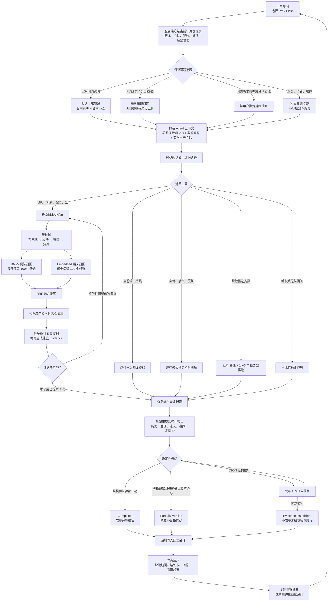

```mermaid
flowchart TD
    A["用户提问<br/>选择 Pro / Flash"] --> B["服务端冻结当前计算器场景<br/>版本、心法、配装、循环、场景哈希"]
    B --> C{"判断问题范围"}

    C -->|"没有明确说明"| D["默认：旗舰端<br/>当前赛季 + 当前心法"]
    C -->|"明确无界 / 分山劲·悟"| E["无界知识问答<br/>关闭模拟与对比工具"]
    C -->|"明确历史赛季或其他心法"| F["按用户指定范围检索"]
    C -->|"身份、作者、昵称"| G["独立来源点查<br/>不形成战斗结论"]

    D --> H["构造 Agent 上下文<br/>系统提示词 v10 + 当前问题 + 有限历史会话"]
    E --> H
    F --> H
    G --> H

    H --> I["模型规划最小证据路径"]

    I --> J{"选择工具"}

    J -->|"攻略、机制、配装、宏"| K["检索版本知识库"]
    J -->|"当前输出基线"| L["运行一次基线模拟"]
    J -->|"空转、怒气、覆盖"| M["运行模拟并分析时间轴"]
    J -->|"比较候选方案"| N["运行基线 + 1～3 个强类型候选"]
    J -->|"越权或无法回答"| O["生成结构化拒答"]

    K --> K1["硬过滤<br/>客户端 → 心法 → 赛季 → 分类"]
    K1 --> K2["BM25 词法召回<br/>最多保留 100 个候选"]
    K1 --> K3["Embedded 语义召回<br/>最多保留 100 个候选"]
    K2 --> K4["RRF 融合排序"]
    K3 --> K4
    K4 --> K5["相似度门槛 + 同文档去重"]
    K5 --> K6["最多返回 5 篇文档<br/>每篇生成独立 Evidence"]

    K6 --> P{"证据够不够？"}
    P -->|"不够且值得改写查询"| K
    P -->|"够了或已检索 2 次"| Q["强制进入最终报告"]
    
    L --> Q
    M --> Q
    N --> Q
    O --> Q

    Q --> R["模型生成结构化报告<br/>结论、发现、建议、边界、证据 ID"]

    R --> S{"确定性校验"}

    S -->|"结构和证据都正确"| T["Completed<br/>发布完整报告"]
    S -->|"结构能解析但部分内容不合格"| U["Partially Verified<br/>隐藏不合格内容"]
    S -->|"JSON 结构损坏"| V["允许 1 次报告修复"]
    V --> S
    V -->|"仍然损坏"| W["Evidence Insufficient<br/>不发布未经校验的结论"]

    T --> X["追加写入历史会话"]
    U --> X
    W --> X

    X --> Y["界面展示<br/>阶段动画、结论卡、指标、来源超链"]
    Y --> Z["复制完整摘要<br/>或从侧边栏继续追问"]
    Z --> A
```