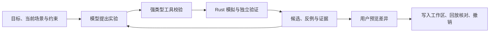

# 苍云武学助手：让 AI 在模拟器里做实验

面向《剑网3》苍云 PVE 玩家：把手动技能轴写成宏、调整输出循环、选择装备，都需要反复检查动作、资源和伤害。这个原型把这些操作接入同一套自主实验运行时，让自然语言目标最终落到**可复跑的候选、比较证据和可撤销的实际编辑**。

例如，玩家可以提出：“保留当前配装，改进这条循环，给我两页以内的宏。”这是输入示例；具体能否改善必须由这次实验验证。

## 一次开始，持续试验

玩家从可拖动悬浮球打开侧栏，输入目标并设置预算。DeepSeek 自主选择观察、修改、模拟、诊断和下一次实验；写宏、循环搜索、配装搜索都是可组合的工具。模型可以直接提出候选，也可以调用搜索算子，从任意已有候选继续分支。旧 AI 分析保留在同一侧栏的另一标签页。

模型负责决策；伤害、资源与时间轴由现有确定性模拟器计算。自主运行时独立于旧 AI 编排器，仍共用原伤害计算链。工具没有任意 shell 或文件写入权限。

## 三个玩家问题，同一条证据链

| 问题 | 交付与判定 |
| --- | --- |
| 技能轴写宏 | 生成宏并重新模拟，按动作顺序、时间和可观察资源状态对齐；技能次数相同不足以证明还原。 |
| 优化循环 | 自拟或搜索候选，记录实际结算时长，只在可比较条件下显示提升；可另改延迟或随机种子验证。 |
| 自动配装 | 从完整 12 槽、精炼、镶嵌、附魔和五彩石重算属性，执行锁位、品级、加速等约束；搜索保留原有强化配置。 |

每次实验保留父候选、完整参数、场景与构建身份、结果指纹及失败原因。模型读取反例后再调整；等价实验复用已有证据。独立验证另行模拟并明确环境是否改变，同场景重放不会被标成留出验证。**可运行、还原成功、输出改善是三个不同结论。**

运行受模型调用、模拟次数、时间和 Token 预算约束。取消会保留已有证据，等待在途模拟退出后释放占用；检查点支持在原预算内恢复，构建身份变化时拒绝混用旧结果。

## 方案真正落到编辑器

用户选择候选后，先看宏、技能轴或装备差异，再点“应用方案”。服务端准备事务；浏览器核对当前场景未改变，实际写入循环与配装器，并调用模拟器核对回放指纹。失败时尝试恢复原快照，恢复失败明确报错。

本页保留撤销点，撤销后再次核对原场景；应用后若用户继续编辑，则拒绝覆盖后续改动。编辑器无法无损表示的特殊宏分页在预览时拒绝写入，仍可下载完整宏。服务器准备成功不等于浏览器应用成功，刷新页面也不承诺恢复本页撤销点。

## 已验证什么

2026-09-22 前端工程验收：

| 检查 | 结果与范围 |
| --- | --- |
| Node 回归 | 29 / 29：场景完整性、身份检查、乱序事件、应用回滚、撤销及旧写宏兼容。 |
| 真实浏览器关键路径 | 10 / 10，页面异常 0：拖动与缩放、旧 AI 切换、候选展示、实际宏与配装应用／回放／撤销、过期候选拒绝、导出和移动端。 |

浏览器验收使用隔离 worker 和离线协议 fixture，但调用真实模拟器、装备目录与工作区写入路径。它证明工程链路可用，**不计作 DeepSeek 的任务成功率**。真实模型能力需用独立题单、逐轮记录和失败案例另行评价。

最终 DeepSeek Flash 固定题单本轮 **4 / 4** 完成：写宏、循环、锁位配装及联合实验。联合题使用 12 轮模型调用、62 次实际模拟，约 74 秒，交付继承配装候选并通过独立回放的宏。开发中也出现预算耗尽和输出截断，保留在[完整验收记录](../baselines/2026-09-22-harness-v2.md)中；不把最终一轮结果当作开放任务成功率。

这套方法得到的是**给定场景、候选范围与预算内已测试方案中的最好结果**。有限搜索和少量留出验证不能证明全局最优，也不能替代游戏内实测；未知装备价格与获取条件不会由模型补造。公开部署另需完成鉴权、HTTPS 与入口限流。

实现与复跑入口：[架构及 API](../HARNESS_V2.md)、[自主运行时](../../backend/src/harness/run_loop.rs)、[工作区事务桥接](../../frontend/harness-workspace.js)、[Node 回归](../../tools/harness-run-ui-test.js)、[浏览器验收脚本](../../tools/harness-run-ui-smoke.py)。
