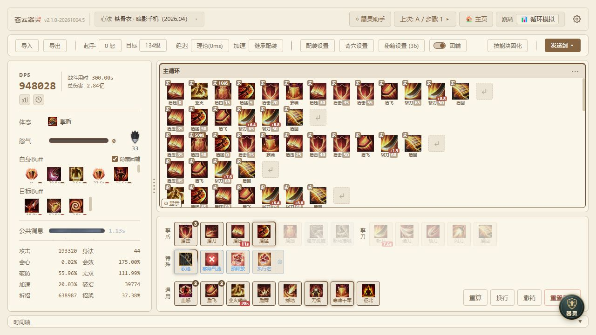
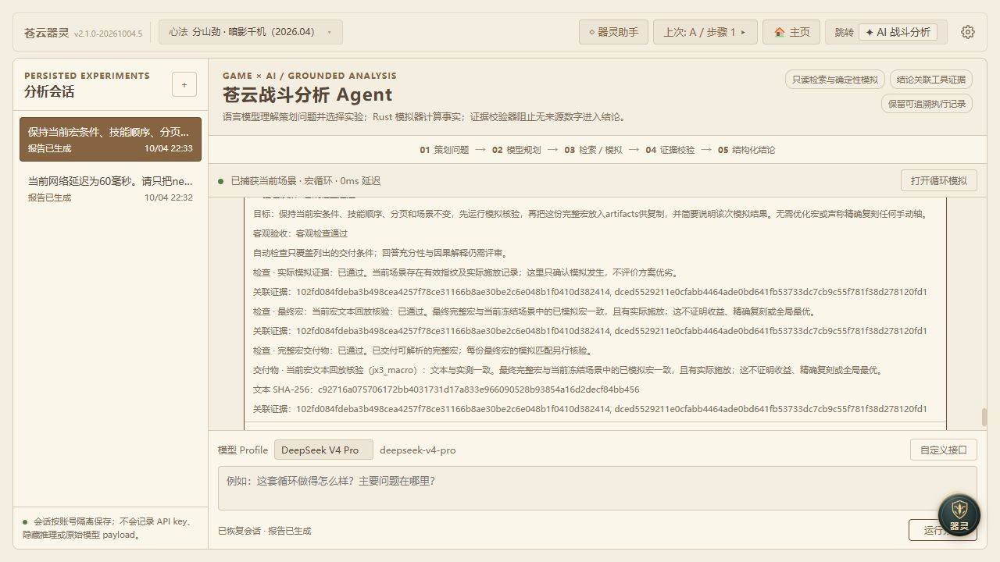
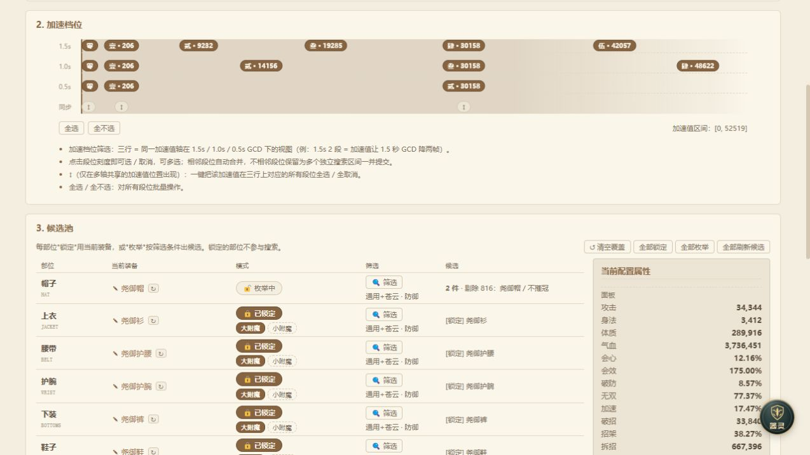
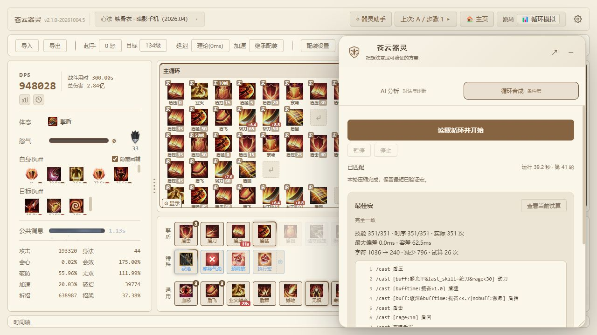

# 苍云器灵

苍云器灵的设计目标，是让《剑网3》苍云双心法的循环问题能够沿战斗过程得到解释。玩家判断技能为何放晚、换装是否值得时，需要同时检查技能顺序、怒气和增益，单看总 DPS 难以确定差异发生在哪一步。项目据此设计模拟和分析流程，借助开发 Agent 构建平台，使循环诊断、装备选择和宏验证能够依托同一套战斗记录展开。

## 战斗状态建模

可比较的模拟首先需要统一技能结算依据。模型按版本和心法组织技能、奇穴、秘籍及装备特效，每次施放都读取当前怒气、刀盾体态和冷却，再结算资源消耗、返还及增益变化。伤害计算保留分步取整和不同伤害类型的结算差异。技能预览、循环模拟和策略搜索共用这些规则，使同一个技能在各项功能中能够按相同条件计算。

循环输入还需要容纳玩家安排技能的不同方式。手动技能轴给出预定的动作次序，条件宏则依据施放时的怒气、冷却等状态选择技能。模拟保留每次实际施放及其前后状态，将两种输入都展开为可查看的战斗过程。用户由此可以检查预定次序如何执行，也能追溯宏在某一时刻选择该技能的条件。

## 循环差异分析

定位循环问题，需要把输出差异追溯到具体的施放环节。模拟因此同时记录伤害构成、技能次数、等待和增益覆盖。例如，调整技能顺序后，可以先看哪些招式的伤害发生变化，再检查怒气是否提前耗尽、关键技能是否延后、增益窗口是否错开。技能统计缩小了排查范围，时间轴继续说明变化发生的过程，为下一次调整提供依据。

方案比较还需要保留产生结果的完整配置。装备、奇穴秘籍、循环和战斗环境随方案一起保存，比较候选时继承同一场景，再改变需要研究的部分。用户查看差异后，可以返回相应记录核对当时的条件。一次比较因而包含明确的配置、改动和战斗过程，也成为后续 AI 分析可以直接读取的实验对象。

# AI 分析工作流

AI 分析从用户当前操作的场景出发，才能确定问题所指的对象。用户在循环或配装界面发起侧栏分析，也可以进入完整会话继续讨论；“这段循环的问题在哪里”等提问，都需要结合眼前的方案理解。工作流因此先读取版本、心法和配置，再安排机制查询或候选比较，将自然语言问题转成针对当前方案的分析任务。

## 工具调用策略

每一步工具调用都应回答当前尚未解决的问题。分析流程将场景读取、技能查询、知识检索、模拟和时间轴定位封装为工具：确认技能作用时查询定义，解释输出变化时查看记录，判断候选收益时运行对照。缺少用户偏好或关键条件时，再补充询问。工具选择因而随已有证据推进，使后续计算始终服务于明确的判断。

循环调整的分析体现了这一推进方式。用户提出候选后，模型可以先取得当前基线，再比较两套方案的伤害和技能分布；如果关键招式的次数变化，就继续查看相邻的资源状态及等待记录。后一次检查由前一次结果引出，直到能够说明差异形成的过程。最终解释也可以沿这些记录，交代调整影响了哪个环节。

这种分析需要把语言判断和战斗计算分别落实到合适的工具。语言模型负责理解目标、选择实验和解释证据，Rust 模拟器负责执行战斗规则并返回结果。业务工具协议独立于模型接口，使不同模型可以使用相同的技能查询和模拟能力。更换模型后，分析仍可围绕同一场景继续，并用相同的工具结果检查其判断。

## 分析上下文管理

多轮讨论能够延续，前提是始终分清用户已经决定了什么。会话分别保存原始目标、用户补充和已确认约束，模型提出的改法保留为候选，后续再依据用户回答补充取舍条件。长对话压缩时继续保留关键任务信息及相关证据，使下一轮既能接着分析，也能沿用用户此前确认的范围。

保留下来的证据还要符合当前场景，才能继续支持判断。知识检索标明版本和适用范围，实验结果绑定当次配置；切换心法、装备或候选后，重新检查旧结果适用于哪些条件。界面提供来源引用和时间轴入口，用户可以从解释返回相应记录，核对这项结论所依据的机制和配置。

分析中的建议需要经过确认，才能落实为用户的配置。分析工具因此采用只读权限，模型先生成候选并说明依据，实际应用另行处理。界面同时呈现执行阶段和工具动作，让用户知道已经完成了哪些查询及实验。候选由此保留了可查看的形成过程，用户可以结合原始目标决定是否采用。

# 分析任务验收

分析任务的完成条件需要落实到实际执行和最终产物。模型组织出完整回答时，要求的模拟可能尚未发生；解释结果时再次改写宏，也会使交付文本偏离已测版本。验收流程据此分别检查任务执行、产物一致性和解释内容，使任务是否完成能够由操作记录和交付对象逐项判断。

## 原宏验收案例

图中的实际任务以验证当前宏为目标，要求完整保留宏条件、技能顺序、分页和场景，先运行模拟，再交付可复制的原宏并说明结果。工作流将这些要求连同原始目标保存，随后读取场景、执行模拟并关联产物。这使验收对象明确为指定条件下的原宏，后续检查可以直接对照用户要求。

这次任务通过三项具体检查确认交付完整。实际模拟记录说明所要求的操作已经发生，文本核对确认最终宏沿用了已测内容，产物检查则确认用户拿到了可复制的完整宏。图中三项均已通过，因此交付文本能够对应本次模拟结果，用户可以按原有条件继续使用和复查这份方案。

## 分层验证

解释是否成立，还需要沿具体机制检查其依据。格式检查使系统能够读取报告，任务验收确认操作和产物齐备，内容审读再核对伤害差异及资源变化的说明。验收保留这一审读环节，逐项核对引用来源、配置和时间轴，使有关机制的判断能够回到相应记录中接受检查。

开发协作同样需要让后续修改延续已有设计。项目规范记录可信来源顺序、版本及心法范围、用户数据保护和代码要求，具体任务再写明输入、允许修改的范围及验收条件。开发 Agent 因此可以依据同一套材料实施改动，完成后沿既定入口复查功能，减少在后续任务中重新解释项目规则的需要。

接入新能力时，验证工作按其在流程中承担的任务分别展开。工程回归检查代码行为，工具测试检查参数和权限，真实模型任务检查工具选择及交付表现；算法实验则固定场景和评价口径，记录候选质量及执行效率。不同检查回答各自的问题，使接入决定能够同时考虑实现情况和实际任务表现。

# 约束条件下的配装搜索

配装搜索首先需要符合玩家实际能够调整的范围。玩家可能希望保留关键装备，也可能只准备更换附魔，重新搜索整套装备会偏离这次选择。因此，界面允许按部位、品级、属性标签和套装限定候选，并分别锁定装备及小附魔。玩家的限制由此直接进入搜索条件，生成的组合也能对应本次换装需求。

减少组合数量时，需要保留套装和特效造成的机制差异。算法先按目标加速区间排除不合要求的组合，再用增量属性计算和去重减少重复工作；随后按套装及特效身份分组，采用 Pareto 筛选，排除各项属性均不占优且至少一项更差的组合。这样，面板接近但机制不同的装备仍保有各自的比较范围。

## 候选评价流程

较大的候选池需要先估计收益，才能缩小完整模拟的计算范围。项目通过属性扰动模拟建立二阶收益模型，将属性之间的交互纳入估计，再据此预筛候选。由于一种属性的收益可能随其他属性的取值而变化，这一步同时考察组合中的影响，为后续复算挑出值得继续比较的方案。

最终排序回到战斗模拟，使套装和特效按候选的实际配置生效。保留的组合使用共同宏循环及战斗环境复算，装备和附魔身份参与特效结算，展示的 DPS 来自这一步。结果同时列出装备、附魔和面板，并提供候选附近的属性收益曲线，让用户在选择组合时也能查看属性变化对输出的影响。

## 局部换装分析

已有案例展示了这套流程如何处理局部换装。用户只枚举帽子和项链，其他部位保持锁定，搜索就在这两个部位的候选中生成并比较组合。结果中的百分比以锁定部位组成的参考配置为基准，因此读者可以结合搜索范围理解数值所指的变化，再检查哪些帽子和项链组合值得采用。

一次搜索得到的候选还可以成为下一次分析的起点。用户可以将它设为新基线，或保存到方案对比中，继续查看循环和伤害构成；需要改变限制时，再从新的范围展开比较。结果由此衔接到后续的选择过程，玩家能够逐步检查换装如何影响当前方案，再决定采用的配置。

# 宏蒸馏

宏蒸馏要解决的是如何用条件规则复现已经形成的目标技能轴。技能轴直接给出动作次序，宏则根据怒气、冷却和增益选择技能，同一条条件在后续状态中还会反复参与判断。因此，生成宏时需要检查规则在整段战斗中的作用，确保局部条件能够持续产生目标要求的动作。

第一阶段先确定候选能否复现目标行为。流程根据回放中的实际状态构造规则，再用原生模拟器完整执行候选，对照动作顺序和时点；出现差异时，从首次分歧处检查条件，修正后重新回放。首次分歧为修改提供具体位置，完整回放则检查改动对后续动作的影响，使验收一直覆盖到战斗终点。

## 宏压缩验收

能够复现目标后，第二阶段再减少宏的规则和条件长度。压缩尝试删减规则、重写条件，以及利用混合条件的上下文进行替换，每次改写都沿用原场景和验收要求。候选只有再次通过原生模拟器的完整回放，才能更新为最佳结果，使字符数的减少始终建立在动作顺序和时序仍符合要求的基础上。

搜索还保留经过验证的等长中间候选，为后续简化提供路径。一次改写可能暂时没有减少字符，却改变了条件的表达方式，使下一步有机会继续压缩。这类候选同样经过完整回放，确认其执行行为后再用于后续搜索。因此，过程可以探索多种表达方式，同时沿用同一套行为验收标准。

| 固定案例 | 初始 → 压缩 | 动作匹配 | 最大时差 |
| --- | --- | --- | --- |
| 分山劲 | 3110 → 381 字符 | 325 / 325 | 35.5ms |
| 铁骨衣 | 1036 → 240 字符 | 351 / 351 | 0ms |

两组固定案例展示了压缩后宏的完整执行结果。两例均按 62.5ms 时序容差检查到完整终点，分山劲复现 325 次目标施放，最大时差为 35.5ms；铁骨衣复现 351 次，时差为 0ms。字符数分别降至 381 和 240，因此可以结合动作匹配及最大时差，判断这两次压缩保留了怎样的执行表现。

宏蒸馏的产物仍需回到玩家的使用流程中检查。该功能作为独立工作流运行，生成宏后可以返回循环模拟，查看伤害构成及资源变化，用于游戏时再按分页和字数要求整理。目标技能轴、候选文本和完整回放由此形成可复查的记录，后续调整搜索方法时，也能沿用相同场景比较压缩结果。

[苍云器灵项目源码](https://github.com/LinXin-CMU/jx3-combat-sim)
